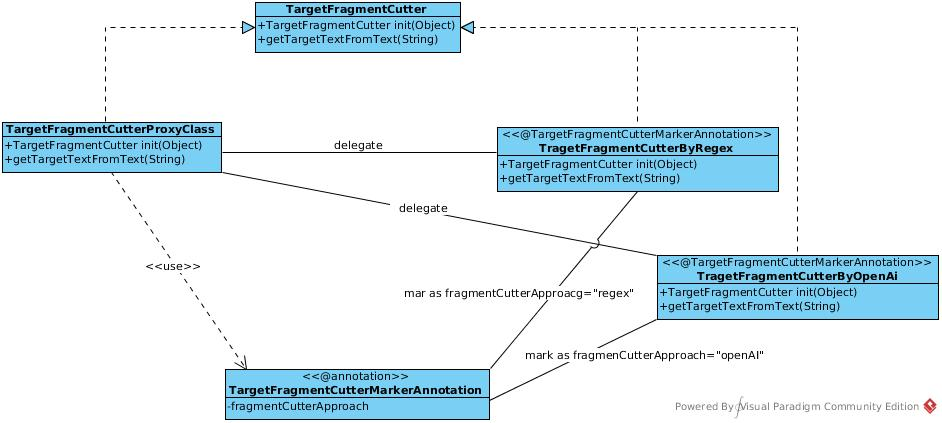
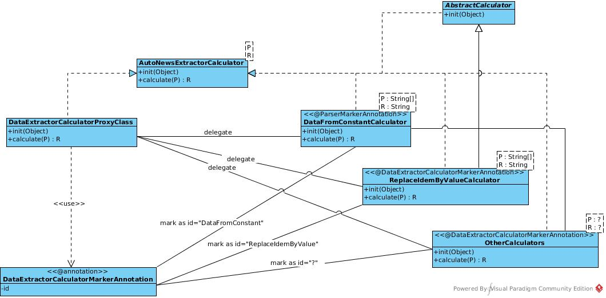
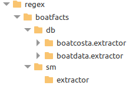
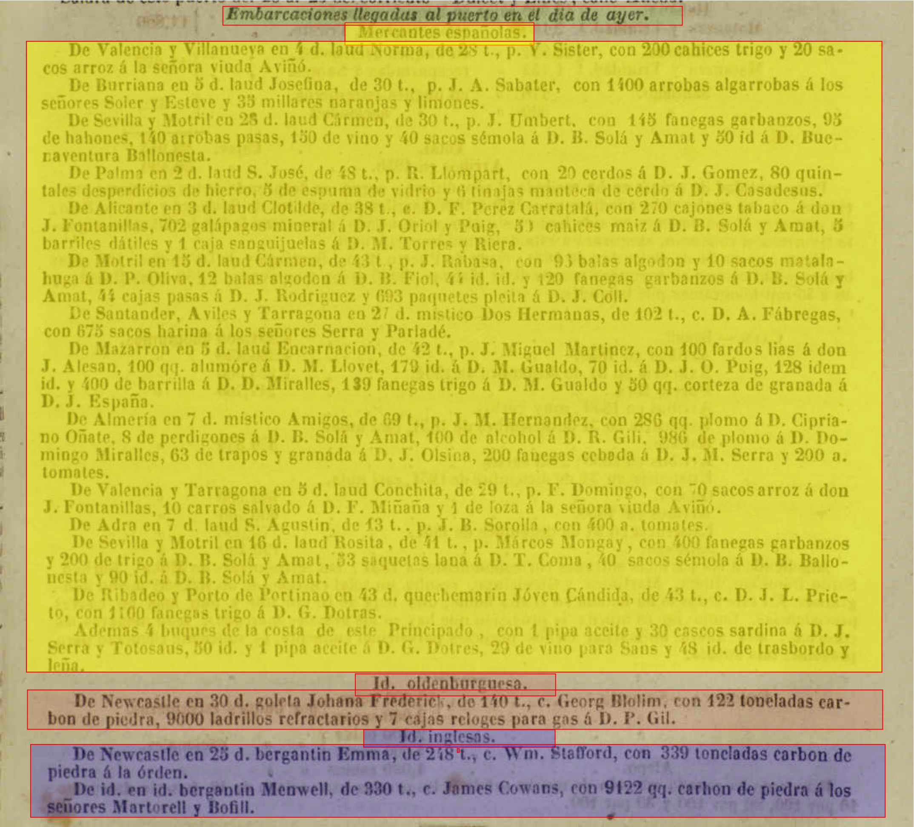

<div align="center">
<h1>Configuration for Data Extraction</h1>
<h2>Developer Manual: Extracting Information from News Articles for the PortAda Project</h2>
</div>

# Latest news
The version of the names of fields to be extracted has been updated, according to the latest decisions taken. In addition, an automatic system has been implemented to update the configuration JSON files. This version updater adapts the names of old fields to the new nomenclatures, in all cases, both in reference to the extraction fields, as well as to the calculated fields and even to the parameters received by the calculation processes, except for those processes that receive a field name using the parameter type _literalParams_. The reason for this is that this type of parameter is used to send any type of data and it is not possible to know _a priori_ if the data is or is not a field name.
To avoid later problems, a new type of parameter has been added that allows indicating, in addition to the value, the category to which the parameter belongs. Currently, 3 categories are accepted: _fieldName_ to indicate that the value is the name of a field, _fieldValue_ to indicate that the field contained in the parameter must be converted to a value before executing the calculation, and _literal_ to send any other value. This way, automatic update processes will be able to recognize and change any update referring to a field name (see the section [Configuration of each extraction level, in the description of the parameter types for the calculators](#configuration-of-each-extraction-level) ).


# Developer Manual

This manual is designed to assist developers in the **_PortAda_** project in creating the necessary configuration files for the **PAPI** and **PAPCLI** applications. These files enable data extraction related to vessels arriving at the different ports studied, as referenced in the newspapers used as sources for the project.

To streamline the configuration process for the extractors, a standalone application has been developed for exclusive use by developers. This application is not integrated into **PAPICLI** and can be accessed at the following link: [autoNewsExtractorDev.zip](https://drive.google.com/file/d/1UBCOwoWMHVPY9bpfrQbXnQQh5WSmgjz4/view?usp=sharing). The download contains only executables and scripts for preparation; configuration directories must be added separately. The application's source code is available on GitHub: *[jportada_boat_fact_extractor](https://github.com/portada-git/jportada_boat_fact_extractor)*.

Before diving into the practical aspects of configuring the extractors, this manual provides an overview of the library upon which the extraction application is built: *[jportada_auto_news_extractor_lib](https://github.com/portada-git/jportada_auto_news_extractor_lib)*.

# The Library _jportada_auto_news_extractor_lib_

The *[jportada_auto_news_extractor_lib](https://github.com/portada-git/jportada_auto_news_extractor_lib)* is a generic library designed to facilitate the creation of tools aimed at extracting data from textual sources. It offers great flexibility, minimizing the need for new code development. Below are three key functionalities of this library that are crucial for data extraction within the PortAda project.

## Features of _jportada_auto_news_extractor_lib_

### Digital File Assembler

This feature allows the merging of multiple text files belonging to the same informational unit generated by an OCR processor from digitized newspapers into a single file. Although the library supports other methodologies, the **_PortAda_** project opts for an approach based on the naming convention of files generated by the OCR processor.

During text extraction from newspaper images, the images are segmented into blocks to facilitate organization and transcription. The project uses During the process of obtaining the text from the images of the analysed newspapers, the images are divided into blocks to facilitate their ordering and textual transcription. In the project, it was decided to name each block with a name that allows identifying the date, the name of the newspaper, the edition of the copy (morning, afternoon, ...), as well as the type of news, the page and the block number processed by the OCR.

This format allows us to determine that all text files belonging to the same date, newspaper, and edition, may contain related information from the same information unit and, therefore, we need to unite it in a single text in order to have a well-ordered text.

In addition, at the same time that the union is carried out, we obtain extra information that is not found in the news item, object of our analysis and subsequent extraction. We refer to the data indicated in the name: Date of the issue, place of publication, name of the newspaper, issue edition and pages from which the extraction will be carried out. This information will be incorporated into the rest of the extracted data.

Therefore, it is important that the names of the files follow the pattern described as `YYYY_MM_DD_POR_NP_E_PG_BLOC.txt`,  where:
- `YYYY` = Year of publication
- `MM` = Month
- `DD` = Day
- `POR` = Port referenced in the news (e.g., BCN, BUE, HAB, MAR)
- `NP` = Newspaper abbreviation (e.g., DB for Diario de Barcelona)
- `E` = Edition type (M = morning, T = afternoon, N = night, U = unique)
- `PG` = Page number (two digits)
- `BLOC` = Block number processed by OCR (four digits)

Example:  
`1854_04_25_BUE_EN_U_E_08_0005.txt`  
This file represents the fifth block on page 8 of news about ship arrivals at the port of Buenos Aires, from *El Nacional*, published in a single edition on April 25, 1854.

### Target Fragment Cutter

Once all the blocks are merged into one, this function extracts the target news fragment or section for analysis, separating it from unrelated content. In the PortAda project, this is achieved by using regular expressions to define the start and end points of the relevant section. This step ensures that only the required text is processed, reducing noise that could introduce errors during data extraction.

### Analyzer for Data Extraction

This feature extracts and classifies information from the target text into predefined categories, referred to as *fields*. These fields include:

- __model_version__: Indicates the version of the model field name.
- __publication_date__: Displays the date of the newspaper
- __publication_name__: Displays the name of the newspaper
- __publication_edition__: Indicates the edition of the newspaper in case there is more than one a day: M for morning, T for afternoon or N for night. In case there is only one edition the value will be U (unique).
- __news_section__: It is the type of news that is analyzed. It can take values ​​such as E for ship entries or M for discharge manifests.
- __travel_departure_port__: Indicates the port of departure of the ship on this voyage
- __travel_arrival_port__: Indicates the port of arrival (Marseille, Buenos Aires, Havana or Barcelona) of the ship on this voyage. In most cases, this information is not reported in the news and is implicitly deduced from the newspaper
- __travel_departure_date__: Indicates the date of departure of the ship from the port of departure
- __travel_arrival_date__: Indicates the date on which the ship arrived at the port of arrival (Marseille, Buenos Aires, Havana or Barcelona)
- __travel_arrival_moment__: Indicates the time of arrival at the port. It can be expressed as arrival time or as a longer period (morning, afternoon, evening, ...)
- __travel_duration_value__: Indicates the time that the ship was travelling from the port of departure to the port of arrival days or hours
- __travel_duration_unit__: Indicates the time unit in which the duration is expressed.
- __travel_port_of_call_list__: Indicates the list of ports (and optionally more information such as arrival or departure dates) in which the ship had called during its journey to the port of arrival. If the information in this list is only the name of the ports, the list will be composed of port names separated by commas. Otherwise, each port of call information will be enclosed in square brackets separated, also by commas, and within each of them the following will be specified, if possible: the name of the port, the date of arrival at that port and the date of departure (according to the 3 fields below). 
- __port_of_call_place__: Displays the port name of an item in the port of call list
- __port_of_call_arrival_date__: Displays the arrival date of an item in the port of call list
- __port_of_call_departure_date__: Displays the departure date of an item in the port of call list
- __ship_type__: Describes the type of ship (brig, schooner, steamer, etc.) mentioned in the newspaper
- __ship_flag__: Refers to the name of the country or region of the flag of the ship described by the newspaper
- __ship_name__: Indicates the name of the ship which is usually presented in full, as mentioned in the newspaper source
- __ship_tons_capacity__: Specifies the ship's capacity in tons presented as a numeric value with the unit of measurement. For ships, this is always the same, as it refers to the ship's tonnage. This information is usually given with abbreviations such as "ton." or "t."
- __ship_tons_unit__: Referred to the unit of the ship's tonnage. Usually given with abbreviations such as "ton." or "t."
- __master_role__: This refers to the category of the person who commands the ship. This can be captain or skipper, although in some cases it also appears as pilot. The abbreviations used to designate them are usually “c” and “p”, respectively
- __master_name__: This is the nominal identification of the person who commands the ship. It can appear in various forms, at least with the surname, preceded by his position (role). It indicates the surname of the ship's captain, often preceded by “cap.” or “c.”
- __ship_agent_name__: This information can indicate both the ship's agent, that is, the person who is in charge of the transactions and operation of the ship, and the shipowner, that is, the person who owns the ship or part of it. Sometimes it can also refer to the shipowner
- __crew_number__: This is the numerical value of the ship's crew.
- __cargo_list__: This is the description of the list containing information on all cargo transported by the incoming vessel (type of cargo, quantity, person receiving the cargo, if any, or “to order” otherwise, etc.). Initially, it will be shown as a comma-separated textual description, but in a second phase, each commodity will be broken down into the following 6 fields.
- __cargo_merchant_name__: This is the person to whom the cargo was destined, often the merchant who had bought it and who took charge of it at the time of unloading. It indicates the recipient of the cargo, with occasional mention of “divers”.
In this case we see names of people or companies. These names have the same characteristics and difficulties as the rest of the names. Sometimes the ships arrived fully loaded and were destined for the same person, and in other cases, each cargo had its recipient. The expression “a la orden” also frequently appears, which in principle is a cargo to be sold upon arrival at port and which, on the contrary, has no previous owner, beyond the captain himself personally or on behalf of someone.
- __cargo_commodity__: It expresses the products or types of merchandise that have arrived. It is a very variable value, the most common merchandise being coal or cotton, but there is an extraordinary diversity of products that arrive at the port.
- __cargo_quantity__: Numeric expression of the amount of the cargo
- __cargo_unit__: Expresses the units in which the cargo appears. These can be units of weight, volume, counts or units related to packaging.
- __cargo_port_origin__: Port of origin of the cargo
- __cargo_port_destination__: Port of destination of the cargo
- __quarantine__: Information regarding special conditions of arrival due to health circumstances.
- __forced_arrival__: Indication of the causes of forced arrival
- __ship_amount__: This field appears only in quantitative models where, instead of specifying the information for each vessel, the number of vessels that have arrived or are about to arrive is indicated. Normally, this is a model specifically designed for cabotage transport.
- __ship_origin_area__: This field appears only in quantitative models where, instead of specifying information for each vessel, the origin or transport area is used. Normally, this is a model specifically intended for cabotage transport.
- __info_ship_type__: [TO DO]
- __info_ship_name__: [TO DO]
- __info_master_role__: [TO DO]
- __info_master_name__: [TO DO]
- __info_meeting_place__: [TO DO]
- __info_meeting_date__: [TO DO]
- __info_port_deparure__: [TO DO]
- __cargo_info_departure_date__: [TO DO]
- __info_port_destination__: [TO DO]
- __info_behind__: [TO DO]

Two methodological approaches are available for extraction:
1. **Regex-based**: Built on regular expressions, with components defined in the library.
2. **AI-based**: Utilizes generative AI (OpenAI) for data extraction.

## Proxy-Based Software Design

The *[jportada_auto_news_extractor_lib](https://github.com/portada-git/jportada_auto_news_extractor_lib)* library is designed to support diverse methodological approaches to data extraction. To facilitate current approaches and allow future extensions, the library incorporates a set of proxies that can seamlessly handle multiple methodologies tied to specific functionalities, organized through interfaces.


Four different proxy patterns have been implemented. One for each functionality (file assembly, target fragment segregation and content analyzer) and a fourth system to manage the so-called field calculators. At the start of execution, each proxy searches among a defined set of packages for the classes annotated by the proxy's associated marking annotation. At the start of execution, the proxy will use its associated annotation to find all the classes that implement the interface linked to the proxy and thus manage the delegation of client requests based on a selection parameter (the approach).

### Proxy System for File Assembly Functionality

In this case, only one specific approach has been implemented for the PortAda project. However, additional methodologies could be developed in the future. This system is based on a _Proxy_ annotated with _InformationUnitBuilderMarkerAnnotation_, which implements the _InformationUnitBuilder_ interface by delegating to the class _InformationUnitBuilderFromSdlFiles_.


### Proxy System for Target Fragment Segregation

Similarly, this system uses a proxy annotated with _TargetFragmentCutterMarkerAnnotation_, which implements the _TargetFragmentCutter_ interface and delegates to classes such as _TargetFragmentCutterByRegex_ and _TargetFragmentCutterByOpenAI_.



### Proxy System for Content Analysis for Data Extraction

This system includes a proxy annotated with _ProxyAutoNewsExtractorParser_, which implements the _ExtractorParser_ interface and delegates to classes like _RegexExtractorParser_ and _OpenAiExtractorParser_.


### Proxy System for FieldCalculator Utilities

The FieldCalculator utilities are designed to assist in manipulating and computing extracted fields (or others) based on a dataset and runtime parameters. The UML diagram below illustrates the design:



To automate all possible initializations, these utilities are linked to an _Enum_ class containing identifiers for each initialization argument. The following initialization options are available:

1. **config**: Initializes the calculator with a *Configuration* object. For the PortAda project, this would be an *AutoNewsExtractorConfiguration* object containing all necessary parameters for processing vessel-related news. The configuration object can be accessed using the method *getInitData("config")*.

2. **parserId**: An integer indicating which of the multiple parsers for extraction is currently active. Since extraction might involve different patterns within the same section or article, multiple parsers can be used, defined in the *AutoNewsExtractorConfiguration* as a list of candidates. The *parserId* specifies the active parser during processing and can be accessed using *getInitData("parserId")*.

3. **constants**: A JSON object containing constant values required for calculations. These can be accessed using *getInitData("constants")*.

4. **extracted_data**: While generally the extracted data (current or prior) is passed as parameters to the *calculate* method, this option allows the data to be passed by reference during initialization. This is useful for calculators that need to perform multiple operations on various fields, enabling reuse of a single calculator instead of implementing separate ones for each field.

The *calculate* method can receive an object or list containing all necessary data. For example, the *ReplaceIdemByValueCalculator* accepts a string array with two elements: the current value of the field to be processed and the last extracted value of the same field. The result is a flexible system that avoids unnecessary duplication and allows generic calculators to be reused across multiple configurations.

For further details on how to configure this calculation system, refer to the section [Configuration](#configuration).

## Configuration

The *jportada_auto_news_extractor_lib* library includes several configuration systems that complement each other. The system is initialized using parameters passed via the command line or via a standard configuration file (e.g. `.ini`, `.properties`). This file contains attributes and their values ​​separated by an equals character. Additionally, for regular expression-based approaches, the library supports a set of configuration files stored in directories, allowing the definition of partial regular expressions. These can be combined to create complex expressions. We will call this type of configuration a _regular expression set_ or _regex_ system and it will usually be located in the "regex" directory, although there is an initial configuration attribute that can be assigned another location.

Finally, there is a third configuration system specifically for defining extraction rules. This system uses JSON format and is typically found in a file named `extractor_config.json`, though the name and location can also be specified through initial configuration.

Below is a detailed description of these three configuration systems.

### Initialization or Initial Configuration

The system can be initialized through command-line arguments or a configuration file (`.ini`, `.properties`). By default, the library searches for a file named `init.properties` in the execution directory or a subdirectory named `config`. However, a different location can be specified using the `-c [INIT_CONFIG_FILE]` argument. Most attributes can be passed via either the file or the command line. If duplicate parameters are provided, those from the command line take precedence.

#### Command-Line Arguments

- **-h**, **--help**: Displays the help message and exits.

- **-c** *[INIT_CONFIG_FILE]*, **--init_config_file** *[INIT_CONFIG_FILE]*: Specifies the path to the initial configuration file (default: `config`).

- **-d** *[ORIGIN_DIR]*, **--origin_dir** *[ORIGIN_DIR]*: Directory containing OCR files with news articles.

- **-o** *[OUTPUT_FILE]*, **--output_file** *[OUTPUT_FILE]*: Specifies the output file path. Example: `-o /path/to/output/file`.

- **-a** *[APPENDOUTPUTFILE]*, **--appendOutputFile** *[APPENDOUTPUTFILE]*: Indicates whether to append extracted vessel data to the existing output file. Accepts values such as `[s]i`, `[y]es`, `[c]ert`, `[t]rue` for true. All other values are considered false.

- **-x** *[FILE_EXTENSION]*, **--file_extension** *[FILE_EXTENSION]*: Specifies the file extension to be processed.

- **-r** *[REGEXBASEPATH]*, **--regexBasePath** *[REGEXBASEPATH]*: Directory containing the regular expressions for analysis.

- **-f** *[FACT_MODEL]*, **--fact_model** *[FACT_MODEL]*: Specifies the type of fact or news to analyze. For the PortAda project, the type is `_boatfacts_`.

- **-n** *[NEWSPAPER]*, **--newspaper** *[NEWSPAPER]*: Specifies the newspaper used for extraction (e.g., db, sm, lp, dm, en, etc.).

- **-oe** *[OCR_ENGINE_MODEL]*, **--ocr_engine_model** *[OCR_ENGINE_MODEL]*: Indicates the specific OCR engine models to apply, if needed.

- **-p** *[PARSE_MODEL]*, **--parse_model** *[PARSE_MODEL]*: Specifies the parser models to use, identifying the textual pattern of the target news article.

- **-pcf** *[PARSER_CONFIG_JSON_FILE]*, **--parser_config_json_file** *[PARSER_CONFIG_JSON_FILE]*: Specifies the JSON configuration file for the extractor.

- **-tfb_pck** *[TARGET_FRAGMENT_BREAKER_PROXY_PACKAGES_TO_SEARCH]*, **--target_fragment_breaker_proxy_packages_to_search** *[TARGET_FRAGMENT_BREAKER_PROXY_PACKAGES_TO_SEARCH]*: Specifies the packages where the proxy will search for different target fragment segregation approaches.

- **-iub_pck** *[INFORMATION_UNIT_BUILDER_PROXY_PACKAGES_TO_SEARCH]*, **--information_unit_builder_proxy_packages_to_search** *[INFORMATION_UNIT_BUILDER_PROXY_PACKAGES_TO_SEARCH]*: Specifies the packages where the proxy will search for different information unit builder approaches.

- **-dex_pck** *[DATA_EXTRACT_PROXY_PACKAGES_TO_SEARCH]*, **--data_extract_proxy_packages_to_search** *[DATA_EXTRACT_PROXY_PACKAGES_TO_SEARCH]*: Specifies the packages where the proxy will search for different data extraction approaches.

- **-decb_pck** *[DATA_EXTRACT_CALCULATOR_BUILDER_PACKAGES_TO_SEARCH]*, **--data_extract_calculator_builder_packages_to_search** *[DATA_EXTRACT_CALCULATOR_BUILDER_PACKAGES_TO_SEARCH]*: Specifies the packages where the proxy will search for different field calculator classes.

- **-fbapp** *[FRAGMENT_BREAKER_APPROACH]*, **--fragment_breaker_approach** *[FRAGMENT_BREAKER_APPROACH]*: Specifies the methodological approach for separating target fragments. Currently, only the "regex" approach is implemented.

- **-exapp** *[EXTRACTOR_APPROACH]*, **--extractor_approach** *[EXTRACTOR_APPROACH]*: Specifies the methodological approach for extraction. Currently, only the "regex" approach is implemented.

- **-rd** *[RUN_FOR_DEBUGGING]*, **--run_for_debugging** *[RUN_FOR_DEBUGGING]*: Indicates whether to run in debugging mode. Accepts values such as `[s]i`, `[y]es`, `[c]ert`, `[t]rue`, `[v]ertader` for true. All other values are considered false.

The configuration file accepts all long-form attributes supported via the command line and includes additional parameters related to logging.

### Regex Set Configuration

To create complex regular expressions, the library allows defining multiple files containing partial expressions. These partial expressions can be used to compose new ones, which in turn can be reused recursively. This configuration resides in the "regex" directory but can be relocated via initial configuration.

#### Complex Regex Composition

A composite regex might look like this:
```regex
^(.*{##vessels##} {##arrivals##} .{2,7} {##port##}.{8,25})\s+$
```

Here, {##vessels##}, {##arrivals##}, and {##port##} refer to substitution placeholders that are replaced by the contents of their respective files (e.g., vessels.regex, arrivals.regex, port.regex). For example:

 - vessels.regex: [EA]{2,3}ship.{2,4}s
 - arrivals.regex: (?:[UIH])[eoa]rriv[eo]d..
 - port.regex: p[uo][eo]rt[eo]

The final composite regex would be:

```
^(.*[EA]{2,3}ship.{2,4}s (?:[UIH])[eoa]rriv[eo]d.. .{2,7} p[uo][eo]rt[eo].{8,25})\s+$

```

#### Directory Structure for Regex Files

The jportada_auto_news_extractor_lib library has a very flexible search system for files (.regex) with the expressions to be replaced. These files are located in various directories branched from a root directory in such a way that they form a hierarchical structure.



Regex files are organized hierarchically, starting from a root directory with four levels:
1. Level 0 (root): Files with very generic regular expressions are located, which can be used as components of other expressions applicable to any type of news.
2. Level 1: Specific for news of a certain type. For example, news about boat facts (*boatfacts*), such as port entries, unloading, etc.
3. Level 2: Specific for the specific treatment that a certain newspaper makes of a type of news. For example, the specific structure under which the Diario de Barcelona groups news about boats.
4. Level 3: Specific to support the extractor model. It allows defining either very specific regular expressions of the model, or the initial regular expressions from which the system will compose the complex regular expression with which to do the extraction.

Root regular expressions, also called initial or main, because they are the first compound expression from which the final expression is to be recursively generated, need an auxiliary file with the same name, but with the extension "_.options_", to define the options (flags) of the search process of the expression following the standardized notations: g (global search), m (multiline search), i (case-insensitive search - case **i**nsensitive), s (search for line breaks included, the entire string is taken as if it were a single line), U (the search supports unicode characters), u (if the option 'i' is selected, special unicode characters are also searched without taking into account upper or lower case).

The system guarantees that the files are found within the _regex_ structure, without specifying the location, knowing only the name. The search is performed from the most specific level outwards, allowing flexibility to replace generic regular expressions with more specific regular expressions.

#### Alternative regular expressions

The content of .regex files must be a valid regular expression with two exceptions: replacement components, which will always have the format `{##file_name##}`, and line breaks, which will be considered alternative expressions when composing. That is, a file containing:

```
[EA]{2,3}ship.{2,4}s
[UI]{2,3}arrival.{2,4}s
.{1,3}port.{1,2}[io]
```

This translates into a single regex:

```
(?:[EA]{2,3}ship.{2,4}s)|(?:[UI]{2,3}arrival.{2,4}s)|(?:.{1,3}port.{1,2}[io])

```

This approach simplifies creating highly complex regex files in a human-readable format.

### Prompt Set for OpenAI

[==TO DO ...==]

### Content Extractor Configuration

Content extractors or analyzers oriented to extraction will be configured using a JSON file, whose structure allows managing the instantiation and execution of one or more extractors, whether they have a "regex" or "openai" approach.

Often, the information to be extracted can respond to more than one textual pattern within the same news, section or newspaper. This forces us to work with more than one analyzer (one for each existing text pattern). For example, in the Diario de Barcelona, ​​in the same section on arrived vessels, there are two types of textual patterns: those that detail the characteristics of the trip, the vessel and the cargo transported: "From [PORT_OF_DEPARTURE] [, PORT_OF_CALL[, ... [and LAST_PORT_OF_CALL]]] in [TIME] [DAYS_HOURS], [TYPE_VESSEL] [VESSEL_NAME]..." , and those that report on coastal vessels, which instead of detailing each ship, report the number of vessels and the cargo they carry between them all. In this case, the textual pattern is: "In addition, [NUMBER_OF_VESSELS] vessels from the coast of this principality are heading to port with [DETAIL_OF_THE_CARGO]". As these are such different patterns, it will be necessary to define them separately.

The `parse_model` attribute in the configuration file (*init.properties*) must list the extractors for the different patterns, using comma-separated names. These names are identifiers and can take any value, as long as they match the keys defined in the JSON configuration file. For instance:
```properties
parse_model=boatdata.extractor,boatcosta.extractor
```

The JSON configuration file should contain matching keys, each defining a JSON object with specific settings:

```json
{
    "boatdata.extractor": {
        ...
    },
    "boatcosta.extractor": {
        ...
    }
}
```

#### Configuring a Regex-Based Extractor

The configuration of each parser is formatted as a JSON object with the following fields:
- **field_version**: Indicates the version of field names used in this configuration. For example: 'boat_fact-00.00.00'".
- **constants**: This is a JSON object with the set of constants (key name and value) needed to configure this extractor or its calculators. For example:
```json
{
"arrival_port": "Barcelona",
"puertos_por_id":{
"BCN":"Barcelona",
"BUE":"Buenos Aires",
"HAV":"La Habana",
"MAR":"Marseille"
}
}
```
<dl><dd>
As you can see in the example, each constant can contain simple data or compound data.
</dd></dl>

- **config**: This attribute is in _array_ format and defines multiple extraction levels.

##### Hierarchical Content Relationships

Textual information often follows a hierarchical structure. For example, in the following image we can see that the information in the title refers to all the entries in the section. Thus we can affirm that all the entries for the following vessels occurred the day before the date of publication of the newspaper (yesterday). On the other hand, we can also see that under the subtitle of Spanish merchant vessels (highlighted in yellow) a set of entries are reported, all of them Spanish vessels, although this information does not appear in the text. In fact, we deduce that all the vessels highlighted in yellow are Spanish, the one highlighted in orange is Oldenburg and the ones in blue are English.



This deduction responds to the implicit structure in the textual distribution. Thus we can conclude that from the first subtitle ("Spanish merchants" in the example) to the next ("id. oldenburg") the vessels share the flag extracted from the subtitle. Those between the second and third subtitle, on the other hand, share the flag extracted from the subtitle ("oldenburg") and those below the third subtitle to the end must be "English".

In this case, more than one regular expression will be needed to analyze and extract all the information contained in the section. On the one hand, we will need, at least, a regular expression that identifies the subtitles and extracts the flag and on the other, a regular expression that identifies and extracts the rest of the information for the text that remains between subtitle and subtitle. Therefore, the *config* attribute of the JSON file may have several specifications depending on how many hierarchical levels our text has.

##### How the regular expression-based extractor works

We must understand the analysis process based on regular expressions as a cyclic process of partial search for the textual pattern identified by the regular expression. Each time the pattern is found within the text, the information is extracted and then the search is continued in the text that remains to be analyzed until reaching the end. The extractor of the library _jportada_auto_news_extractor_lib_ takes advantage of this process so that, after each search, the analyzed text in which the searched pattern has not been found is stored, in order to apply a new search to it by the next level extractor.

Let's see a graphic example to illustrate it. Let's imagine that our text was like the color graph in the image and that the hierarchy, instead of going from top to bottom, was from left to right. Therefore, the information in the blue box would belong to the entire text (highest hierarchy). The purple boxes would represent the second level of the hierarchy and the orange ones the third. Thus, each orange box, in addition to its information, should also have the corresponding information in purple and blue.

 

When the application extraction process starts processing, the first extractor of the hierarchy is chosen, which will search for all the blue patterns existing in the text. When it finds the first one at the beginning of the text, it extracts the information and continues its search with the remaining text.

 

When there is no more text with the blue pattern, the extracted information is reserved and the second level extractor is switched to, which will detect purple patterns. It will find the first one at the beginning of the analyzed text, extract the information and continue searching.

 

The next purple pattern is found, but since it is not found at the beginning of the text, its information is extracted (associating it with the information extracted from the previous level) and the text where nothing has been found is reserved, to perform a third level analysis when the second level is finished. The search continues.

 

The operation is repeated with the next purple pattern.

 

Since there are no more purple patterns, the text is reserved for the next level.

 

When the third level analyzer is activated (to search for orange patterns), it finds the first text at the beginning, reserves it and associates it with the information found in previous levels. The search continues.

 

The operation is repeated with the last reserved text in the first block of purples. The search continues with the second block of purples.

 

The process is repeated for each block until the complete information for all of them is obtained.

 

##### Copying data at the same level

Now that we have seen the extraction process in hierarchical texts in detail, we are going to propose another possible solution for hierarchies that are not repeated. The _jportada_auto_news_extractor_lib_ library allows you to force the copying of the fields you indicate, between searches of the same hierarchical level. In this type of news, the messages can be quite cryptic, due to the need to reduce the text as much as possible. This means that, sometimes, some information that appeared previously is assumed to be implicit and does not appear in the new entry. This does not always happen, but it can happen. If it happens, we must force the copy. We can also take advantage of this feature to save ourselves the creation of an extraction level when the information of a higher level is never repeated (it appears only once). Continuing with the example of colors, if we add an alternative to the search pattern for purples consisting of searching for blues and purples. That is,
```
{##blue##}\n{##purple##}
{##purple##}
```
We can get the information for the blues from the purple pattern, thus avoiding the creation of the specific extractor for the blues. So, in order for this information to extend to all the other purple entries, we must force a copy of the actual blue fields.

Therefore, we have two valid ways to deal with the hierarchical information that only appears once, either we create a specific extractor that gets its information, or we extract it from the extractor of the next level and force its copy.

##### Configuration of each extraction level

For each of the extractors, the following characteristics must be defined in a JSON object format:

- **approach_type**: Allows you to indicate the extractor's approach. It supports 'regex' or 'openai'. It is necessary to clarify that the following configuration is specific to 'regex' since the one corresponding to 'openai' is shown in the section related to the configuration of openAi extractors.
- **configuration**: is an object that will contain the following specification:
- **main_regex**: Name of the initial '.regex' file that will originate the entire final extraction expression.
- **max_groups**: This is a numeric data and indicates the maximum number of groups that the expression will handle. At least the number of fields that this expression obtains should be indicated, although, if the main expression needs several alternatives, the value will be a multiple of the number of fields to be extracted (number of fields * number of alternatives).
- **fields_to_extract**: _Array_ with the specification of the extraction of each field in the same order as they appear in the text
- **fields_to_calculate**: _Array_ with the specification of the calculation to be performed on those fields where it is necessary.

For each field to be extracted (item of fields_to_extract), the following must be indicated:
- **key**: Name of the category or field that will be given to the extracted value in the group of the regular outer corresponding to the same position that this definition has in the _array_ 'fields_to_extract'.
- **temporary_field**: Indicates whether the name defined in 'key' will be temporary or will correspond to some definer in the version of the extraction model identified by 'field_version'.
- **default_value**: Value that we want to give to the field in case the regular expression is not able to identify its value. This is important to give a specific value to those fields that are used to calculate others, in order to avoid problems in the processing of the calculation, but it is also important to assign a value that allows to distinguish the fields not found from those found. For example, "???" would allow to distinguish at a glance the fields found from those not found.
- **copy_last_value**: This attribute needs a boolean value (true/false) and allows to reduce the number of extractors to add in 'config'. A value of true indicates that its value will be copied to the next extraction found by the regular expression. Thus, the information belonging to the main title can be copied to the rest of its same category without the need to establish an extractor for the higher category.

For each field to calculate (item of fields_to_calculate), the following must be indicated:
- **calculator**: name that identifies the calculator so that the proxy can find it.
- **key**: name of the field where the value calculated by this calculator will be dumped. - **temporary_field**: This is the same as its counterpart "_ fields_to_extract_". If it has already been defined previously, it will not be necessary to repeat the information here.
- **init_data**: This is an optional data. If it appears, it must be in _array_ format. It will indicate the multiple initializations that this calculator needs. Valid values ​​will be: "configuration", "parser_id", "constants" or "extracted_data" defined in the section [Proxy system for FieldCalculator utilities](https://github.com/portada-git/developers_portada_project_documentation/blob/main/ManualDesarrolladores.md#sistema-del-proxy-para-las-utilidades-fieldcalculator).
- **params**: This data is optional depending on whether the calculator requires parameters to be passed or not. If it appears, it must contain the specification of each parameter in JSON object format separated by commas. The specification of each parameter contains the indication of the parameter type and its value. The currently allowed types are: literal, fieldValue and fieldName. The literal type indicates that the value can be any and is not subject to checking for version updates. The fieldValue type indicates that the value will contain the name of the field from which the value is to be extracted before running the calculator. It supports the prefixes extracted_data or last_extracted_dat depending on whether the newly extracted value or the value obtained from the last complete extraction is desired. For example, if `["extracted_data.master_role", "last_extracted_data.master_role"]` is specified, the specified calculator will be passed the role of the person in charge obtained in the extraction process (let's say 'id.') and the same category, but whose value was obtained in the extraction of the vessel read just before the current one (let's say 'cap.'). The fieldName type indicates that the parameter value will be the name of an existing field during the extraction. It is important to use this type to facilitate the verification and updating of the configuration file fields automatically.
- **fieldParams**: This data is optional. If it appears, the names of the fields from which you want to obtain their value must be passed, preceded by _extracted_data._ or _last_extracted_data._, depending on whether you want the newly extracted value or the value obtained from the last complete extraction. For example, if `["extracted_data.master_role", "last_extracted_data.master_role"]` is specified, the role of the person in charge obtained in the extraction process (let's say 'id.') and the same category, but whose value was obtained in the extraction of the vessel read just before the current one (let's say 'cap.') will be passed to the specified calculator. Although this format is maintained, it is advisable to use the *params* version instead.
- **literalParams**: This data is optional and will correspond to the list of literal values ​​that you want to pass as parameters to the calculator. Any literal value is accepted if it is defined in _array_ format. For example: `["Havana"]. Although this format is maintained, it is advisable to use the *params* version instead.

##### Complete configuration example

The following example of a complete configuration serves as an illustration of what has been described:
```json
 {
    "boatdata.extractor": {
        "field_version": "boat_fact-00.00.00",
        "constants": {"arrival_port": "Barcelona"},
        "config": [
            {
                "approach_type": "regex",
                "configuration": {
                    "max_groups": 15,
                    "fields_to_extract": [
                        {
                            "temporary_field": true,
                            "default_value": "y",
                            "copy_last_value": true,
                            "key": "time_of_arrival"
                        },
                        {
                            "temporary_field": true,
                            "default_value": "mercante",
                            "copy_last_value": true,
                            "key": "purposeType"
                        },
                        {
                            "default_value": "????",
                            "copy_last_value": false,
                            "key": "ship_flag"
                        }
                    ],
                    "fields_to_calculate": [
                        {
                            "calculator": "TimeOfArrivalRelativeToPublicationCalculator",
                            "temporary_field": true,
                            "init_data": [
                                "configuration",
                                "parser_id"
                            ],
                            "fieldParams": ["extracted_data.time_of_arrival"],
                            "key": "time_of_arrival"
                        },
                        {
                            "calculator": "ElapsedTimeFromArrivalToPublicationCalculator",
                            "temporary_field": true,
                            "fieldParams": ["extracted_data.time_of_arrival"],
                            "key": "elapsed_days_from_arrival"
                        }
                    ],
                    "main_regex": "flag"
                }
            },
            {
                "approach_type": "regex",
                "configuration": {
                    "max_groups": 10,
                    "fields_to_extract": [
                        {
                            "default_value": "????",
                            "copy_last_value": false,
                            "key": "ship_departure_port"
                        },
                        {
                            "default_value": "??",
                            "copy_last_value": false,
                            "key": "ship_travel_time"
                        },
                        {
                            "default_value": "?",
                            "copy_last_value": true,
                            "key": "ship_travel_time_unit"
                        },
                        {
                            "default_value": "????",
                            "copy_last_value": false,
                            "key": "ship_type"
                        },
                        {
                            "default_value": "????",
                            "copy_last_value": false,
                            "key": "ship_name"
                        },
                        {
                            "default_value": "????",
                            "copy_last_value": false,
                            "key": "ship_tons"
                        },
                        {
                            "temporary_field": true,
                            "default_value": "t.",
                            "copy_last_value": false,
                            "key": "ship_tons_unit"
                        },
                        {
                            "default_value": "????",
                            "copy_last_value": false,
                            "key": "ship_master_role"
                        },
                        {
                            "default_value": "????",
                            "copy_last_value": false,
                            "key": "ship_master_name"
                        },
                        {
                            "default_value": "????",
                            "copy_last_value": false,
                            "key": "ship_cargo_list"
                        }
                    ],
                    "fields_to_calculate": [
                        {
                            "calculator": "DataFromConstantCalculator",
                            "init_data": ["constants"],
                            "key": "ship_arrival_port",
                            "literalParams": ["arrival_port"]
                        },
                        {
                            "calculator": "PortOfCallsFromOriginPortCalculator",
                            "init_data": [
                                "configuration",
                                "parser_id",
                                "extracted_data"
                            ],
                            "key": "ship_port_of_call_list",
                            "literalParams": ["ship_departure_port"]
                        },
                        {
                            "calculator": "ReplaceIdemByValueCalculator",
                            "init_data": [
                                "configuration",
                                "parser_id"
                            ],
                            "fieldParams": [
                                "extracted_data.ship_travel_time",
                                "last_extracted_data.ship_travel_time"
                            ],
                            "key": "ship_travel_time"
                        },
                        {
                            "calculator": "ReplaceIdemByValueCalculator",
                            "init_data": [
                                "configuration",
                                "parser_id"
                            ],
                            "fieldParams": [
                                "extracted_data.ship_travel_time_unit",
                                "last_extracted_data.ship_travel_time_unit"
                            ],
                            "key": "ship_travel_time_unit"
                        },
                        {
                            "calculator": "ShipArrivalDateCalculator",
                            "fieldParams": [
                                "extracted_data.elapsed_days_from_arrival",
                                "extracted_data.publication_date"
                            ],
                            "key": "ship_arrival_date"
                        },
                        {
                            "calculator": "ShipDepartureDateCalculator",
                            "fieldParams": [
                                "extracted_data.ship_arrival_date",
                                "extracted_data.ship_travel_time",
                                "extracted_data.ship_travel_time_unit"
                            ],
                            "key": "ship_departure_date"
                        }
                    ],
                    "main_regex": "boat_fact"
                }
            }
        ]
    },
    "boatcosta.extractor": {
        "field_version": "boat_fact-00.00.00",
        "constants": {"arrival_port": "Barcelona"},
        "config": [
            {
                "approach_type": "regex",
                "configuration": {
                    "max_groups": 15,
                    "fields_to_extract": [
                        {
                            "temporary_field": true,
                            "default_value": "y",
                            "copy_last_value": true,
                            "key": "time_of_arrival"
                        },
                        {
                            "temporary_field": true,
                            "default_value": "mercante",
                            "copy_last_value": true,
                            "key": "purposeType"
                        },
                        {
                            "default_value": "????",
                            "copy_last_value": false,
                            "key": "ship_flag"
                        }
                    ],
                    "fields_to_calculate": [
                        {
                            "calculator": "TimeOfArrivalRelativeToPublicationCalculator",
                            "temporary_field": true,
                            "init_data": [
                                "configuration",
                                "parser_id"
                            ],
                            "fieldParams": ["extracted_data.time_of_arrival"],
                            "key": "time_of_arrival"
                        },
                        {
                            "calculator": "ElapsedTimeFromArrivalToPublicationCalculator",
                            "temporary_field": true,
                            "fieldParams": ["extracted_data.time_of_arrival"],
                            "key": "elapsed_days_from_arrival"
                        }
                    ],
                    "main_regex": "flag"
                }
            },
            {
                "approach_type": "regex",
                "configuration": {
                    "max_groups": 9,
                    "fields_to_extract": [
                        {
                            "default_value": "??",
                            "copy_last_value": false,
                            "key": "ship_amount"
                        },
                        {
                            "default_value": "??",
                            "copy_last_value": false,
                            "key": "ship_origin_area"
                        },
                        {
                            "default_value": "????",
                            "copy_last_value": true,
                            "key": "ship_cargo_list"
                        }
                    ],
                    "fields_to_calculate": [
                        {
                            "calculator": "DataFromConstantCalculator",
                            "init_data": ["constants"],
                            "key": "ship_arrival_port",
                            "literalParams": ["arrival_port"]
                        },
                        {
                            "calculator": "ShipArrivalDateCalculator",
                            "fieldParams": [
                                "extracted_data.elapsed_days_from_arrival",
                                "extracted_data.publication_date"
                            ],
                            "key": "ship_arrival_date"
                        }
                    ],
                    "main_regex": "unknown_boat_fact"
                }
            }
        ]
    }
}
```

#### Configuring an OpenAI-Based Extractor

The openAI parser implemented in the porTADA project can be used at any level of the text hierarchy to be analyzed, regardless of the type used at other levels. This means that a set of mixed parsers (regular expressions and openAI) can be configured.

The configuration for "openai" parsers is defined using a JSON object with two main attributes: _approach_type_, which must be assigned the value "openai", and the _configuration_ field, which contains the specific configuration so that openAI can extract the information corresponding to the level for which it is configured.

The configuration field is a JSON object with the following attributes:
- _parse_by_paragraphs_: This is a Boolean type and allows you to indicate whether the analysis will be performed paragraph by paragraph or using all available text. If its value is _true_, the text of the level to be analyzed will be broken into paragraphs, and each paragraph will be passed to openAI separately. If its value is _false_, the entire text of the level will be passed to openAI.
- _save_parsed_data_: This is another Boolean attribute to indicate whether the text of the analyzed level will be saved in the output JSON under the "parsed_text" attribute.
- _model_: Indicates the name of the openAI model we want to use for extraction, for example "gpt-4o-mini".
- _model_config_:

## Preparing the Configuration

To begin configuring the extractors for the _PortAda_ project, you will need to either download the _autoNewsExtractorDev_ application from the link [autoNewsExtractorDev.zip](https://drive.google.com/file/d/1UBCOwoWMHVPY9bpfrQbXnQQh5WSmgjz4/view?usp=sharing) and unzip it, or clone the repository [jportada_boat_fact_extractor](https://github.com/portada-git/jportada_boat_fact_extractor).

If no additional coding is required, downloading and installing the compiled application is the preferred option. However, if the information from your newspapers necessitates custom calculations for extracted fields, cloning the repository would allow you to add the required code. For now, you can start by downloading the application and cloning the repository later if necessary.

## Installing _autoNewsExtractorDev_

To install the application, simply extract the downloaded archive [autoNewsExtractorDev.zip](https://drive.google.com/file/d/1UBCOwoWMHVPY9bpfrQbXnQQh5WSmgjz4/view?usp=sharing). This will create a directory named `_run_autonewsextractor_dev_`, which contains the executable file (`boat_fact_extractor.jar`) and 10 scripts (5 for Windows and 5 for Linux/Mac) designed to facilitate configuration and testing.

After extracting the files, you will need to set up the configuration directories. To simplify this process and minimize errors, a GitHub repository called [_portada_boat_fact_extractor_config_data_](https://github.com/portada-git/portada_boat_fact_extractor_config_data) has been created. It contains predefined directories and key files for each project team. The repository ensures that the final configurations can be uploaded to the project server.

Clone the _portada_boat_fact_extractor_config_data_ repository to your local machine. Once cloned, move and rename the local repository to `_config_` within the _autoNewsExtractorDev_ execution directory (which should still be named `_run_autonewsextractor_dev_` unless renamed). The resulting structure should look as follows:


Ensure that the `_config_` directory corresponds to your local clone of the _portada_boat_fact_extractor_config_data_ repository. This will allow seamless and safe synchronization of changes made by different teams.

## The _autoNewsExtractorDev_ Application

The _autoNewsExtractorDev_ application does not have a graphical user interface and must be used from the command line. You can execute the provided scripts or directly run the executable file if `.jar` files are associated with your Java Virtual Machine (JVM). The `.jar` file is compiled to run with Java 11 or higher. If your JVM is outdated, update it before proceeding.

### Scripts Included in _autoNewsExtractorDev_

The installation directory (`_run_autonewsextractor_dev_`) contains the following scripts:

1. **BoatFactInfoUnitJoinTest.run / BoatFactInfoUnitJoinTest.bat**  
   Use this script to configure and test the "Digital File Assembly" functionality. It requires specifying the location of the configuration file (`init.properties`), the source directory containing the text files, and the output directory where the assembled files will be saved. This test requires multiple text files for various informational units, some consisting of more than one file.

2. **BoatFactCutterTest.run / BoatFactCutterTest.bat**  
   This script is used to configure and test the "Target Fragment Cutter" functionality. You must configure regular expressions to detect the start and end of the fragment. It also requires pre-assembled text files containing the target fragments (vessel arrivals and manifests) along with unrelated content. You will need to specify the configuration file, the source directory, and the output directory where segregated fragments will be stored.

3. **BoatFactExtractTest.run / BoatFactExtractTest.bat**  
   This script tests the data extraction functionality from text files containing vessel arrival and manifest news. Configure the necessary regular expressions and the JSON file managing the extraction. Specify the configuration file, the source directory, and the base name (without extension) for the output JSON file containing the extracted data.

4. **BoatFactExtract.run / BoatFactExtract.bat**  
   Once individual functionalities are tested, this script integrates all processes into a single operation. Specify the configuration file, source directory, and the base name for the output file containing the results.

5. **BoatFactExtractorCommand.run / BoatFactExtractorCommand.bat**  
   This is a generic script that allows executing any of the four previous functionalities using an additional argument:
   - `information_unit_test`
   - `cut_test`
   - `extract_test`
   - `extract`

   After specifying the functionality, provide the same arguments required for each respective script.

If `.jar` files are associated with your JVM, you can directly execute the `boat_fact_extractor.jar` file, providing the same arguments as those used with the BoatFactExtractorCommand script.

## Configuration and testing of the _BoatFactInfoUnitJoinTest_ utility

This utility requires very simple configuration and a relatively small test bench. It does not require any regular expressions and since there is only one approach, it will only be necessary to check that the "init.properties" file contains the following attributes and values:
- **information_unit_builder_proxy_packages_to_search**=org.elsquatrecaps.autonewsextractor.informationunitbuilder.reader
- **file_extension**=txt
- **informationUnitBuilderType**=file_name
- **metadataSource**=portada_file_name

In the source directory, place text files with names that follow the pattern defined in the [Digital file assembler](#digital-file-assembler) section. That is: YYYY_MM_DD_POR_NP_E_PG_BLOC.txt. Regardless of the content, make sure you have enough names to test the different possibilities.

Execution arguments:

- **-c**: will indicate the name and location of the initial configuration file. For example: `-c config/conf_db/init.properties`
- **-d**: must contain the path of the directory where the text files to be processed are located. Example: `-d data_db`
- **-o**: indicates the path of the output directory where you want to write the resulting files. Input files that do not match the expected pattern will not be copied to the output. Files with the same date, periodical and edition, but with different pages or blocks, will be joined into one with the name of the page and block file below, followed by the suffix "__informationUnit_". If there are not two or more matching files, but it matches the expected pattern, it will be copied to the output directory adding the same suffix.

If in the input directory we have the files:

- 1852_01_01_BCN_DB_U_16_0001.txt
- 1852_01_02_BCN_DB_U_06_0001.txt
- 1852_01_02_BCN_DB_U_07_0001.txt
- 1852_01_02_BCN_DB_U_07_0002.txt
- aaaaa.txt

By running this utility in the output directory we would obtain the files:

- 1852_01_01_BCN_DB_U_16_001_informationUnit.txt
- 1852_01_02_BCN_DB_U_06_001_informationUnit.txt

Example of execution:

`$ ./BoatFactInfoUnitJoinTest.run -c config/conf_db/init.properties -d text_db -o results/iu`


## Configuring and testing the _BoatFactCutterTest_ utility

This utility needs to create at least two files with regular expressions. Depending on the newspapers, four may be needed. The purpose of these regular expressions is to detect the beginning and end of the target fragment so that the entire text of a newspaper to be treated can be divided, isolating the fragment of interest and eliminating the rest.

A regular expression must detect the beginning of the fragment. This will eliminate all the text from the beginning to where the initial part of the fragment has been detected.

A second regular expression will detect where the text can end and eliminate the text that spans from the detected element to the end of the entire text.

Thus, the resulting fragment will be exclusively the fragment of interest.

The files containing the regular expressions will be located as part of the _regex_ system and will follow the logic described in the [Set of regular expressions](#set-of-regular-expressions) section.

### Fragment start detector

It must respond to the name "fragment_initial_detector" and as it is the generating expression it will need the .regex extension, with the desired expression, and also the .options extension, with the active processing options. This expression must divide the text of the file into 3 groups:
1. The first group would contain the text from the beginning until just before, where the fragment of interest begins.
2. The second group will contain a part of the text of interest used to detect the start of the fragment, for example the title of the section, some subtitle, etc.
3. The third group will contain the text that goes from the end of the detection fragment to the end of the file.

Let's see an example. In the Diario de Barcelona, ​​in general, the section related to the boats entered is quite well marked. We often find the list of entries under the title and subtitle:

	SANIDAD DEL PUERTO
	Embarcaciones llegadas a puerto[RELATIVE_DATE_OF_ARRIVAL]

A quick look at the images and their transcriptions allows us to see that the phrase "Vessels arrived ...", is usually written in italics. Most OCR processors present a lower quality with italic letters, so using only the subtitle does not seem like a good idea. On the other hand, the quality of the capital letters is usually somewhat higher than the lowercase ones. So we decided to use the title as a discriminator. This title is not useful to us during the extraction, so we will place it within the first group (the one that should be discarded). On the other hand, the reference to the vessels that arrived yesterday|today|the day before yesterday|..., is useful to us during the extraction, to be able to calculate the arrival date, since this data does not appear explicitly in the news. We should, therefore, place it in the second group. In the third group we will place the rest of the text until the end of the file. Let's see.

A typical news item would be:

	PARTE ECONOMICA.
	AVISOS CASAS DE HUÉSPEDES.
	...
	ABERTURAS DE REGISTRO.
	Para Tarragona, Coruña y Santander. Saldrá de este puerto a la mayor brevedad posible el bergantin español Firme, forrado en cobre, su capitan D. Santiago Matossi; admite carga á flete para dichos puntos. Lo despachan los Sres. Salazar y Torrents, pórtico Xifré, escritorio рітстран
	Para Cádiz y escalas. El vapor español Barcino saldrá el 10 del corriente, á las nueve de la mañana: admitiendo cargo y pasajeros. Se despacha en la calle de la Merced, esquina á la plaza de S. Sebastian, número 46, nuevo, cuarto principal.
	Para Génova y Liorna. Saldrá de este puerto la polacra toscana Calidoro, su capitan D. José Tonietti; para cuyos puntos admite carga á flete y pasajeros. Se despacha en la calle de Abaixadors, núm. 10, cuarto.
	SANIDAD DEL PUERTO.
	Embarcaciones llegadas al puerto en el dia de ayer.
	Mercantes españolas.
	De Christiansund en 33 d. bergantin Fama, de 109 t., c. D. V. Ramon Rodriguez, con 5930 vogs bacalao y 200 de pezpalo á la órden.
	De Almería y Aguilas en 15 d. laud Aguila, de 35 t., p. S. Lopez, con 130 gq. perdigon es á D. A. Sala, 50 id. á D. J. Margarit. 400 de plomo á D. J. Serratosa, 200 fanegas cebada á Don B. Solá y Amat, y 12 millares esparto á D. S. Garriga.
	...
	Mercante francesa.
	De Marsella en 21 horas vapor Elba, de 210 t., c. S. Gabriel , con 69,000 francos á los señores Vidal y Cuadras hermanos, 83,000 id. á los señores Girona hermanos, Clavé y compañía , 23,000 id. D. J. M. Serra, 21,900 id. á los señores Serra y Parladé, 13.000 id. á D. B. Roca y Cortada, 15.000 id. á los señores Staguo, Torrens y compañia, 1500 id. á D. 1. Domenech, 3 cajas sangnijuclas á don B. Solá y Amat, otros efertos para esta, y 103 baltos de varios géneros de tránsito y 30 pasajeros, consignado á los señores Martorell y Bosill.
	Despachadas el 30 de diciembre.
	Bergantin español Wifredo, c. D. J. Ferrer, para Valparaiso con vino, pimenton y bacalao. ...
	
Our initial regular expression proposal would be:
```
^(.*?\nSANIDAD DEL PUERTO)\n(.*?)\n(.*)$
```
That is, all the text from the beginning to 'SANIDAD DEL PUERTO' when this phrase is in capital letters after a line break (since it is a title), is enclosed in a first group. The next line (corresponding to the subtitle) will be captured as group 2, and the rest of the text until the end of the text will be captured as group 3.

So that the regular expression is not analyzed line by line, it will be necessary to indicate it with the `gsuU` options (global analysis -g-, considering all the text as a whole -s- and forcing the acceptance of unicode characters).

When testing this expression we realize that, the title, which in the images is centered, sometimes due to transparency, in the transcriptions some noise may appear to the left and right just before and after the line breaks. We also see that sometimes the title is missing letters or they are transcribed incorrectly. And finally, we realize that sometimes the subtitle is transcribed on the same line as the title. We decided to change the expression to: `^(.*?{##sanidad_del_puerto##})(.*?)\n(.*)$` where *sanidad_del_puerto* is going to be replaced by: `\n[\{| ]{0,3}[S5].{3,5}[DO0][A4][DO0] ?[DO0]E[Ll\[\|] ?.{3,5}[RP][TY][O0]\W*\s*`

With this we reduce the detection of the title to the minimum recognizable expression, and we also add noise characters to the left and right. The operation is now much more efficient.

Before finishing the initial detector, we observed that in some periods, the title SANIDAD DEL PUERTO disappears from the section and we can only recognize "_ Vessels arrived ..._". We decided to keep the expression found, but add an alternative with the subtitle. In this way, where the title exists, the first discriminator will be applied and where it does not exist, the alternative.

The final expression that is efficient in practically all the tested cases is:	
La expresión final que resulta eficiente en prácticamente todos los casos probados, es:
```
^(.*?{##sanidad_del_puerto##})(.*?)\n(.*)$
^(.*?\n)((?:[\{| ]{0,3}(?:{##embarcaciones##})\s+(?:(?:{##llegadas##})|(?:.*{##puerto##}))\s+[^\n]*)\s?{##mercantes##} *\w{3,}[s5]?[\W\s]+)(.*)$
```

To avoid possible low-quality transcriptions due to italics, instead of forcing the entire literal phrase, we reduce it, simplifying its content, but forcing the candidate phrase to be followed by a word similar to _mercantes_. You can consult the _regex_ directory for the files with the replacement values.

It is important to note that when we use alternatives in the same main expression that will generate the entire final expression, we must make sure that each alternative contains exactly the 3 groups, since if we put fewer (or more) groups than expected in one of them, the detection would not work.

### End of fragment detector
In this detector, only the text obtained in group 3 of the previous phase, the one for detecting the start of the fragment, is processed. That is, the one that includes part of the text of interest together with the rest of the text existing between the arrived vessels and the end of the analyzed specimen.

In this case, the regular expression will divide the analyzed text into two groups. In group 1, the fragment with the text of the vessels entered will remain (which must be kept) and in group 2, the remaining text (which must be deleted).

The logic of constructing the expression is similar to the previous one and is defined by the mechanism of composition of the *regex* expression described in the section [Set of regular expressions](#set-of-regular-expressions).

The name of the file containing the main expression also has a fixed name: _fragment_end_detector_ and following the _regex_ considerations of our application, there must be two files with the same name (with the extension _.regex_ and with the extension _.options_). In this case, the options must also treat the text as a whole and the options file will contain `gsuU`.

A preliminary study of a sample of specimens indicates that the list of arrived vessels often ends when the next section begins and, therefore, a title appears in capital letters. However, there are exceptions that, due to their large number, we must consider. Sometimes, the list ends in the same section of PORT HEALTH, but referring to the vessels dispatched on a specific day. The phrase that usually begins the block of dispatched vessels is "Dispatched on [DAY_AND_MONTH]". However, sometimes it can say "the ship ... dispatched on ...". On the other hand, there are also quite a few cases in which the information on the dispatched vessels does not appear. In most of these cases, the list ends by starting another section with a title in capital letters, but there is a small number in which the section corresponding to "Madrid Mail...", received or issued by the government, is transcribed in lowercase.

However, we decided to apply an expression with multiple alternatives; on this occasion we applied a different technique that avoids the repetition of groups in each alternative. The technique used consists of separating the alternatives in a replacement file so that the main _regex_ contains a single line (single alternative). Let's see:

```
(^.*?)({##end_detector_body##}\W*\n.*+$)
```
Using this technique, the alternatives located in the _end_detector_body_ file are inside the group parentheses and it is not necessary to define the groups in each alternative.

The content of the _end_detector_body_ file would be:
```
(?:\s+D[eo][sS5g?][pq].{2,3}h.d.[sS5g?]? .{1,3} {##ocr_digit_no_blanc##}{1,2} .*)
(?:\s+{##boat_fact_vessel##} d[eo][sS5g?][pq].{2,3}h.d.[sS5g?]? .{1,3} {##ocr_digit_no_blanc##}{1,2} .*)
(?:\s+C[eao](?:(?:rr)|(?:m))[aoe][oeo] de Ma.{2,5}d d.. d.a {##ocr_digit_no_blanc##}{1,2} d. .* d. {##ocr_digit_no_blanc##}{2,4})
(?:\s+[A-Z ]{3,})
```
The 4 alternatives discussed above, and tested to be as flexible and efficient as possible, so that it catches almost all cases without error.

### Execution and testing of the utility

Once the files for the composition of the regular expressions for detecting the start and end of the target fragment have been created, we must test its operation by executing the _BoatFactCutterTest_ utility. This utility, in addition to the _regex_ system files, will also need the initial configuration file (_init.properties_) and a set of minimum arguments that will be passed to the _BoatFactCutterTest.[run|bat]_ script from the console.

The necessary arguments will be:
- **-c**: (configuration). This parameter will indicate the name and location of the initial configuration file. For example: `-c config/conf_db/init.properties`
- **-d**: (data directory). This is the parameter that must contain the path to the directory where the text files to be processed are located. Example: `-d data_db`
- **-o**: (output). Indicates the path to the output directory where you want to write the files with the segregated fragments resulting from each file read from the data directory.

For this utility, the initialization file must contain at least the following attributes and values:
- **target_fragment_breaker_proxy_packages_to_search**=org.elsquatrecaps.autonewsextractor.targetfragmentbreaker.cutter (list of packages where to search for the different approaches to this type of classes).
- **file_extension**=txt
- **fragment_breaker_approach**=regex
- **regexBasePath**=config/regex
- **fact_model**=boatfacts (must appear as a _regex_ system directory just below the root (_regexBasepath_).
- **newspaper**=lp (or db, or sm, or dm, ..., represents the newspaper identifier and must appear as a _regex_ system directory at the next level than the _fact_model_ - second level deep from the _regex_ root).
- **parse_model**=[extractor] (this value must match a directory of the _regex_ components, one level below _newspaper_. It can contain multiple values ​​separated by commas and represent the different extraction models, depending on the type of news to be treated. For example, newspapers with discharge manifests and list of incoming boats, should have two models, since the data extracted in each case is different. In This utility can be used to host different segregators for each model.)
- **ocr_engine_model**=documentAI (This value is optional and may or may not appear as a _regex_ system directory. If an auxiliary directory with this name exists at any level of the _regex_ directories, it would have the objective of offering an alternative option to a given regular expression due to the specific idiosyncrasy in the transcription of a specific OCR engine.)

Execution example:

`$ ./_BoatFactCutterTest.run -c config/conf_db/init.properties -d text_db -o resultats/cu`

For each input file, this utility will produce as many files as there are items in the _parse_model_ parameter, since it is assumed that in the same newspaper the fragments corresponding to different types of news will be located in different places and, therefore, will have different start and end detectors. To distinguish them, the output files will take the original name to which they will add a suffix formed by the name of the parse_model preceded by the underscore (_). For example, if `parse_model=[entries,manifests]`, the processing of a file called `1852_01_02_BCN_DB_U_07_0002.txt` would result in the following files:
- `1852_01_02_BCN_DB_U_07_0002_entries.txt`
- `1852_01_02_BCN_DB_U_07_0002_manifests.txt`

## Configuration and testing of the _BoatFactExtractTest_ utility

This is the utility that requires the most configuration. On the one hand, the initial configuration file will also be needed here. For the regular expression-based approach, it will be necessary to adapt the expressions to the extraction to be performed, taking into account the _regex_ system for composing complex expressions already explained (see the section [Composition of complex regular expressions](#composition-of-complex-regular-expressions)). In addition, the configuration will also require a JSON file that specifies how the extraction should be processed, how many hierarchical levels it should have, what fields we want to extract and what calculations will be necessary to transform the data obtained into the data that we will finally save.

### Data prior to extraction
The data extracted from the file name refers to information related to the publication (date, newspaper identifier, edition and pages), they are always available with extracted data, since they are processed as default data. Therefore, if necessary, they could be used to calculate other values.

### Data model and version verification
One of the most critical aspects in a project such as PorTAda is the data model and its integrity, both due to the number of fields and the evolution that they may undergo as the project progresses. The configuration files specify the names of the fields and their characteristics. A transcription error in the name of a field or a mismatch in the versions used could lead to subsequent problems when integrating all the extracted data.

To try to reduce the problem, both the extracted data and the configurations will have a version identifier. In the data, the identifier can allow automatic version changes, avoiding having to repeat processes. In the configuration files, the version identifier will allow verification that it is not out of date and that it does not contain transcription errors in the field names.

The _[jportada_boat_fact_extractor](https://github.com/portada-git/jportada_boat_fact_extractor)_ application will always check the configuration files of the data extractors before starting the process. If it finds an offset or an incorrect field name, it will interrupt the process and report with a message in the console indicating the reason for the problem. In addition, the application has an option to dynamically display the information of the latest version.

The information related to the fields can be consulted in the same _autoNewsExtractorDev_ application using the generic script `BoatFactExtractorCommand.[run|bat]` with the arguments _field_info_ and _-i_ with any combination of the letters VDCA. V indicates that we want to see the name of the current version, D, the description of each field, C the changes suffered in the field names in the different versions and A would be equivalent to putting the 3 letters DCV. For example, if we run:

```
BoatFactExtractorCommand.run field_info -i DV

```

we will get:

```
                 FIELD INFO                      
======================================================================
CURRENT VERSION: boat_fact-00.00.00
----------------------------------------------------------------------
======================================================================
 List of fildes and desciption for the current version
======================================================================
CURRENT NAME FIELD                 FIELD DESCRIPTION                  
----------------------------------------------------------------------
model_version:    Indicates the version of the field name model.
----------------------------------------------------------------------
publication_date:    Displays the date of the newspaper
----------------------------------------------------------------------
publication_name:    Displays the name of the newspaper
----------------------------------------------------------------------
publication_edition:    Indicates the edition of the newspaper in case there is more than one per day: M for morning, T for afternoon or N for evening. In case there is only one edition, the value will be U (unique).
----------------------------------------------------------------------
fact_type:    This is the type of news analyzed. It can take values ​​such as E for ship entrances or M for discharge manifests.
----------------------------------------------------------------------
ship_departure_port:    Indicates the port of departure of the ship in this travel
----------------------------------------------------------------------
ship_arrival_port:    Indicates the port of arrival (Marseille, Buenos Aires, Havana or Barcelona) of the ship in this travel. In most cases, this information does not appear in the news and is implicitly deduced depending on the newspaper
----------------------------------------------------------------------
ship_departure_date:    It denotes the ship’s departure date from the departure port
----------------------------------------------------------------------
ship_arrival_date:    Indicates the date that the ship arrived in the arrival port (Marseille, Buenos Aires, Havana or Barcelona)
----------------------------------------------------------------------
travel_arrival_moment_value:    Indicates the time of arrival at port. It can be expressed as the time of arrival or as a broader period (morning, afternoon, evening, ...)
----------------------------------------------------------------------
ship_travel_time:    Indicates the time that the ship was travelling from the departure port to the arrival port days or hours
----------------------------------------------------------------------
ship_travel_time_unit:    Indicates the unit of time in which the duration is expressed.
----------------------------------------------------------------------
ship_port_of_call_list:    Indicates the list of ports (and optionally more information as arrival or departure dates) that the ship had stopped while on her way to the arrival port. If the information of this list is only the name of ports, the list will be compounded by port names separated by commas
----------------------------------------------------------------------
ship_port_of_call_place:    Show the name of one item of the port of call list
----------------------------------------------------------------------
ship_port_of_call_arrival_date:    Show the arrival date of one item of the port of call list
----------------------------------------------------------------------
ship_port_of_call_departure_date:    Show the departure date of one item of the port of call list
----------------------------------------------------------------------
ship_type:    Describes the type of the ship (brick, brick-goelette, trois-mats, vapeur etc) that the newspaper mention
----------------------------------------------------------------------
ship_flag:    Refers to the name of the country or region of the flag of the ship describe by the newspaper
----------------------------------------------------------------------
ship_name:    Indicates the name of the ship typically presented in full, like is mention in the newspaper source
----------------------------------------------------------------------
ship_tons:    Specifies the ship’s capacity in tons presented as a numerical value with the unit of measurement. In the case of the ships this remains always the same as it refers to the tonnage of the ship. This data is given usually with abbreviations such as "ton." or "t."
----------------------------------------------------------------------
ship_master_role:    It refers to the category of the person who commands the ship. It can be a captain or a skipper, although in a few cases a pilot also appears. The abbreviations used to designate them are usually “c” and “p”, respectively
----------------------------------------------------------------------
ship_master_name:    It is the nominal identification of the person who commands the ship. It can appear in various ways, at least it has the surname, preceded by his position (role). Lists the surname of the ship's captain, often preceded by "cap." or "c."
----------------------------------------------------------------------
ship_agent:    This information could indicate either the ship agent, namely the person that is responsible for the transactions and the operation of the ship or the shipowner, namely the person that owns the ship or part of the ship. Sometimes it can also refers to shipowner
----------------------------------------------------------------------
ship_crew:    It is the numerical value of the ship's crew.
----------------------------------------------------------------------
ship_cargo_list:    It is the description of the list with the information related to all the cargo transported by the incoming vessel (type of cargo, quantity, person receiving of the cargo, if any or "to order" otherwise, etc.)
----------------------------------------------------------------------
cargo_merchant:    It is the person to whom the cargo was destined, often it will be the merchant who had bought it and who took charge of it at the time of unloading. Indicates the recipient of the cargo, with occasional mention of "divers" [various/several].
In this case we see names of people or companies. These names have the same characteristics and difficulties as the rest of the names. Sometimes the ships arrived in full loads and were destined for the same person, and in other cases, each load had its recipient. The expression “a la orden” also appears frequently, which in principle is a load to be sold upon arrival at the port and which, on the contrary, does not have a previous owner, beyond the captain himself personally or on behalf of someone.
----------------------------------------------------------------------
cargo_type:    It expresses the products or types of goods that have arrived. It is a very variable value, the most common goods are coal or cotton, but there is an extraordinary diversity of products that arrive at the port.
----------------------------------------------------------------------
cargo_value:    Numerical expression of the amount of charge
----------------------------------------------------------------------
cargo_unit:    Expresses the units in which the load appears. These may be units of weight, volume, counts, or units related to packaging.
----------------------------------------------------------------------
cargo_origin:    Port of origin of the cargo
----------------------------------------------------------------------
cargo_destination:    Port of destination of the cargo
----------------------------------------------------------------------
ship_quarantine:    Information relative to special conditions of the arrival motivated by sanitary circumstances.
----------------------------------------------------------------------
ship_forced_arrival:    Indication about the causes of the forced arrival
----------------------------------------------------------------------
ship_amount:    This field appears only in quantitative models where, instead of specifying the information for each ship, the number of vessels that have arrived or are about to arrive is indicated. Normally, it is a model specifically intended for cabotage transport.
----------------------------------------------------------------------
ship_origin_area:    This field appears only in quantitative models where, instead of specifying information about each ship, the area of ​​origin or transport is used. Normally, it is a model specifically intended for cabotage transport.

```

The information about the version changes is shown with the current name on the left and the history of changes on the right. The scheme used is:

```
List of changes made in each field throughout the different versions
======================================================================
CURRENT NAME FIELD <= PREVIOUS NAME FIELDS
---------------------------------------------------------------------
current_name_c1 <= name_c1_version_1 <= name_c1_version_0
current_name_c2
current_name_c3
...
current_name_cn <= name_cn_version_0
```

### Use of temporary fields and calculation of definitive fields

There is the possibility that some fields do not appear directly in the news to be extracted, but can be deduced from another. For example, in the Diario de Barcelona, ​​the arrival date is never indicated. However, a temporal relationship of the arrival is explicit, relative to the date of publication. Example:

_Embarcaciones llegadas el día de **ayer**
..._

The heading of the section allows us to deduce the arrival date, from the date of publication and the information relative to the time of arrival with respect to publication (yesterday, today, the day before yesterday, etc.).

It may also happen that we need a temporary field to store an intermediate calculation. For example, continuing with the previous example, we can decide to generate another temporary field with the value of the days passed since the arrival of the boat until the date on which the arrival is published. That is, if the title indicates the day before yesterday, 2 days will have passed. If you indicate yesterday, only 1 day and if you indicate today, 0 days. With this calculated data, it would be very easy to obtain the actual arrival date.

To deal with these cases, we will need to extract information temporarily and apply a certain calculation, store the calculation as a temporary value and use it, finally, to deduce the date. The extracted information ("relative moment of arrival") must be stored with the extracted data in order to be used by the specific calculator. Similarly, the days passed since arrival to the day of publication must also be stored as calculated information. This implies that we must assign a name to each data in the JSON file. Since these are temporary field names not referenced in the data model, the file verification would fail if it were not explicitly indicated that these are temporary values. The verification does not check temporary fields. It can be made explicit that a field is temporary in the field specification, either in the fields to be extracted section or in the fields to be calculated section. Continuing with the example of the Diario de Barcelona:

```json
{
    "boatdata.extractor": {
       ...
        "config": [
            {
                ...
                "configuration": {                   
                    "fields_to_extract": [
                        {
		                        "key": "time_of_arrival",
                            "temporary_field": true
                        },
                        ...
                    ],
                    "fields_to_calculate": [
                        {
                            "key": "elapsed_days_from_arrival",
                            "temporary_field": true,
                            "calculator": "ElapsedTimeFromArrivalToPublicationCalculator",
                            "fieldParams": ["extracted_data.time_of_arrival"],
                        }
                       ...
                    ],
                    ...
                }
            },
            ...
        ],
        ...
   }
}
```

### Existing calculators
Both the *[jportada_auto_news_extractor_lib](https://github.com/portada-git/jportada_auto_news_extractor_lib)* library and the _[jportada_boat_fact_extractor](https://github.com/portada-git/jportada_boat_fact_extractor)_ application have already implemented a set of calculators that can be specified simply in the configuration file. Let's see the existing calculators:

- *DataFromConstantCalculator*: This calculator returns the value of the constant indicated in the input parameters. It requires to be initialized with the set of constant values ​​defined in the JSON configuration file (*extractor_config.json*). <br>Let's see an example, in a *parser_model* called extractor, a constant called *arrival_port* is defined. Later, in the *configuration* section of one of its extractors, the *DataFromConstantCalculator* calculator is specified as one of the fields to be calculated (*fields_to_calculate*), the initialization of which (*init_data*) must be performed with the defined constants. In addition, the name of the desired constant is passed as a literal data parameter ("*arrival_port*"). The value returned by the calculator will be assigned to the field called *ship_arrival_port*.
 ```json
{
    "extractor": {
        "field_version": "boat_fact-00.00.00",
        "constants": {"arrival_port": "Barcelona"},
        ...
        "config":[
            ...
            {
                ...
                "configuration":{
                    ...
                    "fields_to_calculate": [
                        ...
                        {
                            "calculator": "DataFromConstantCalculator",
                            "init_data": ["constants"],
                            "literalParams": ["arrival_port"],
                            "key": "ship_arrival_port"
                         }
                         ...
                    ]
                    ...
                }
                ...
            }
            ...
        ]
        ...
    }
    ...
}
 ```
 
 <dl><dd>
In this example, the *arrival_port* field will be assigned the calculated value "Barcelona".
</dd></dl>

- *DataFromConstantMapAndConfigKeyCalculator*: This calculator is similar to the previous one, but it is specific to handle constants with composite values. It receives two parameters, the name of the constant with composite values ​​and the name of the composite data field required to return its value. <br>Let's see an example, in a *parser_model* called extractor, a constant called *port_candidates* of composite type is defined, with four fields. Later, in the *configuration* section of one of its extractors, the *DataFromConstantMapAndConfigKeyCalculator* calculator is specified as one of the fields to be calculated (*fields_to_calculate*), the initialization of which (*init_data*) must be performed with the defined constants. In addition, the name of the desired constant is passed as a literal data ("*port_candidates*") and the name of the previously extracted or calculated field from which to obtain the value of the second parameter. The value returned by the calculator will be assigned to the field called *ship_arrival_port*.
```json
{
    "extractor": {
        "field_version": "boat_fact-00.00.00",
        "constants": {
            "arrival_port": "Barcelona",
            "port_candidates":{
                "BCN":"Barcelona",
                "BUE": "Buenos Aires",
                "HAV":"La Habana",
                "MAR":"Marseille"
            }
        },
        ...
        "config":[
            ...
            {
                ...
                "configuration":{
                    ...
                    "fields_to_calculate": [
                        ...
                        {
                            "calculator": "DataFromConstantMapAndConfigKeyCalculator",
                            "init_data": ["constants"],
                            "literalParams": ["port_candidates"],
                            "field_params":["news_port"],
                            "key": "ship_arrival_port"
                         }
                         ...
                    ]
                    ...
                }
                ...
            }
            ...
        ]
        ...
    }
    ...
}
```

<dl><dd>
In this example, the *arrival_port* field will be assigned one of the possible values ​​depending on the value found in the *news_port* field.
</dd></dl>

- *ReplaceIdemByValueCalculator*: This calculator receives 2 parameters. The first contains the value to be analyzed and the second contains the replacement value in case the value of the first parameter contains a value similar to "idem" or equivalent. If the value to be checked does not match "idem", its value is returned, but if there is a match, the value returned is that of the second parameter.<br>In the following example, one of the fields to be calculated *ship_travel_time_unit* is configured, using the *ReplaceIdemByValueCalculator* calculator. This is initialized with the configuration ("init_properties") and with the parser_id used during the extraction and calculation process. In addition, it receives the value of the newly extracted *ship_travel_time_unit* field, as well as the value of the last fully extracted entry.
```json
{
    "extractor": {
        "field_version": "boat_fact-00.00.00",
        ...
        "config":[
            ...
            {
                ...
                "configuration":{
                    ...
                    "fields_to_calculate": [
                        ...
                        {
                            "calculator": "ReplaceIdemByValueCalculator",
                            "init_data": [
                                "configuration",
                                "parser_id"
                            ],
                            "fieldParams": [
                                "extracted_data.ship_travel_time_unit",
                                "last_extracted_data.ship_travel_time_unit"
                            ],
                            "key": "ship_travel_time_unit"
                         }
                         ...
                    ]
                    ...
                }
                ...
            }
            ...
        ]
        ...
    }
    ...
}
```

<dl><dd>
If the value of the newly extracted *ship_travel_time_unit* is equivalent to "idem", it will be assigned the value of the last entry. Otherwise, it will be left with the original value.
</dd></dl>

- *TimeOfArrivalRelativeToPublicationCalculator*: This calculator analyzes a text containing "*hoy*", "*ayer*", "*anteayer*" or equivalents and returns a unique identifier for each of them. With a word equivalent to ayer it will return "y" corresponding to the concept "yesterday", with one equivalent to anteayer it will return "b" corresponding to "before yesterday", etc. This calculator requires initialization with the configuration (init.properties) and the parser_id to process. It receives a single parameter with the text containing today, yesterday, the day before yesterday, etc. <br>We see an example in which we want to change the value extracted as *time_of_arrival* replacing it with its temporal identifier according to its content.
```json
{
    "extractor": {
        "field_version": "boat_fact-00.00.00",
        ...
        "config":[
            ...
            {
                ...
                "configuration":{
                    ...
                    "fields_to_calculate": [
                        ...
                        {
                            "calculator": "TimeOfArrivalRelativeToPublicationCalculator",
                            "init_data": [
                                "configuration",
                                "parser_id"
                            ],
                            "fieldParams": ["extracted_data.time_of_arrival"],
                            "key": "time_of_arrival"
                            "temporary_field": true,
                         }
                         ...
                    ]
                    ...
                }
                ...
            }
            ...
        ]
        ...
    }
    ...
}
```

- *ElapsedTimeFromArrivalToPublicationCalculator*: Calculates the number of days elapsed based on the identifier of a relative temporal value (yesterday, today, the day before yesterday). It does not need initial data and only receives, as a single parameter, the identifier of the temporal value.
```json
{
                        ...
                        {
                            "calculator": "ElapsedTimeFromArrivalToPublicationCalculator",
                            "temporary_field": true,
                            "fieldParams": ["extracted_data.time_of_arrival"],
                            "key": "elapsed_days_from_arrival"
                        }
                         ...
```

- *PreviousDateFromElapsedTimeCalculator*: This calculator does not need initial data. Its objective is to calculate a previous date from a numerical value of time expressed in days or hours and a specific date passed as a character string in a defined format. The calculator receives 4 parameters:
- A numerical value indicating the elapsed time
- A value indicating the time unit. If it begins with *h* it is considered hours, if it begins with *d* it is considered days.
- The date from which the calculation should be made in a specific format as a character string.
- The format in which the date is expressed. This parameter is optional. If the date format is yyyy-MM-dd, this parameter is not required. Otherwise, the format must be specified. Example:
```json
{
                        ...
                        {
                            "calculator": "PreviousDateFromElapsedTimeCalculator",
                            "fieldParams": [
                                "extracted_data.ship_travel_time",
                                "extracted_data.ship_travel_time_unit",
                                "extracted_data.ship_arrival_date"
                            ],
                            "literalParams":["dd-MM-yyyy"],                            
                            "key": "ship_departure_date"
                        }
                         ...
```

You can find more information about calculators in the sections [Proxy system for FieldCalculator utilities](#proxy-system-for-fieldcalculator-utilities) and [Configuring each extraction level (](#configuring-each-extraction-level).

### Creating new calculators
It is possible that when specifying some extractor, you need to use a type of calculation that is not yet implemented. If that happens, currently, the easiest way to do it is to clone the repository of this application coded in JAVA from _[jportada_boat_fact_extractor](https://github.com/portada-git/jportada_boat_fact_extractor)_ and create a new class in the package "org.elsquatrecaps.autonewsextractor.dataextractor.calculators" with a meaningful name that reports its function. The class must inherit from AbstractCalculator or from RegexCalculator depending on whether you need to use some regular expression composed with the _regex_ system (inheritance from RegexCalculator) or not (inheritance from AbstractCalculator). The class must be annotated by DataExtractorCalculatorMarkerAnnotation with a unique identifier that allows it to be distinguished from the others. If you do it this way, you will only need to implement a single method called *calculate*. The best solution to avoid type problems and because all extracted fields are, by default, strings, is to always return the value in text type. For the parameters, expecting an array of Strings is also a correct solution. You can access the initial data specified in the *extractor_config* using the `getInitData` method, which will be passed as a parameter the name of the initialization data that you will find defined in ExtraDataCalculatorEnum. For example, if extractor_config has specified for this calculator the need to pass constants, you will get the value of all constants by calling:
`JSONObject constants = getInitData(ExtraDataCalculatorEnum.CONSTANTS.toString());`

Let's see below how we should use annotations and inheritance in a new class:

```java
@DataExtractorCalculatorMarkerAnnotation(id = "NewCalculator")
public class NewCalculator extends AbstractCalculator<String[], String>{
	public static final int PARAM_1=0;
	public static final int PARAM_2=1;
	//...
	//public static final int PARAM_N=???;

	@Override
	public String calculate(String[] params){
		String response = "";
		//Example of obtaining the constants
		JSONObject constants = getInitData(ExtraDataCalculatorEnum.CONSTANTS.toString());
		//Code the calculation here
	
		return response;
	}
}
```
In the event that the implementation of calculators is necessary, you must upload the changes to the repository in order to integrate everything. Until it is integrated, you can generate a local compilation and use your local code.

### Initial text analysis
Another important aspect that we must take into account before starting to specify the extractor configuration is to analyze the text pattern used in the news. The first characteristics to analyze are the text hierarchies and their patterns, the repetition of the same, the inherited information and the implicit information.

The implicit information refers to the information that does not appear anywhere in the news, but that we must supply to the data model. For example, the port of arrival does not usually appear as data, but we need to specify it, since the project works with several. We will add the implicit information in the form of a constant and we will use the calculator "*DataFromConstantCalculator*" or "*DataFromConstantMapAndConfigKeyCalculator*" to assign this value to the desired field.

To analyze the hierarchies, review the section [Hierarchical relationship of the content](#hierarchical-relationship-of-the-content). In addition to the hierarchical relationship, we need to detect whether this hierarchical structure is repeated several times throughout the section or only appears once at the beginning. For example, in the Diario de Barcelona both cases occur. At the beginning of the section, the time of arrival is reported. Let's say: "Boats arrived the day before yesterday." This information appears only once. However, the flag is reported in a subtitle and is repeated several times for the ships of different nationalities entered. Below the flag, the entries for each vessel are repeated following a well-defined format. Thus, we will have three hierarchical levels, of which the first is never repeated. This feature will allow us to use only 2 hierarchical extractors instead of 3 (see the sections [How the regular expression-based extractor works](#how-the-regular-expression-based-extractor-works) and [Copying data at the same level](#copying-data-at-the-same-level).

### Trial and error methodology

The complexity of the configuration, the variability in the wording over time and the different qualities of text obtained from the OCR transcriptions, make it highly advisable to consider an incremental methodology based on trial and error.

By incremental, we mean that we start with the minimum configuration (extraction of a single field). To do this, we configure the _init.properties file, the extraction JSON and compose a regular expression adapted to the news pattern, using the application's own system. The expression is improved based on trial and error with multiple tests that cover a representative diversity of the set of news until we obtain an acceptable extraction quality. Once this is achieved, we will increase the extraction with two fields and repeat the improvement process. One by one we will increase the fields to be extracted until all fields are extracted.

To obtain maximum information while the final configuration is being implemented, you can use the attribute `run_for_debugging=yes`. This option displays in the console the regular expressions used during the extraction process ("*Pattren (from regex_name)*"), as well as the raw text ("*Raw text*") that has been searched with the regular expression, the matched fragment ("*Parsed text*"), the unmatched text that is reserved for the next level of extraction ("*Unparsed text*") and the data extracted from the matched fragment ("*Extracted data*"). Example output during an extraction with the run_for_debugging attribute active:

```
Pattern (from flag): "(?:(?:^(.*(?:(?:E[mn]b.*[eo][s5])|(?:[EA][mn].{3,5}c[i¡Il1][oec]n[eosc]s)|(?:[EA]{2,3}barca.{2,4}nes)|(?:.{1,3}barc.{1,2}c[i¡Il1][oec]n[eosc].)|(?:.mbar.{1,3}c[i¡Il1][oec]n[eosc].)) (?:(?:(?:(?:[|i¡l][|i¡l])|(?:[UHN]))[eoa]g[aoeu]d..)|(?:.{4,6}adas)) .{2,7} p[uo][eo]rt[oe].*)\n+((?:(?:(?:(?:[MmNn]|(?:[ÚU]l?))[eco*][rft](?:(?:[ce][an][bnu][tl][eco*])|(?:ca[nbu][lt][lt]-)))[s5;}]?)|(?:M.r.ant[eoa][s5]?)|(?:.{1,3}rcant[aeo][s5]?)|(?:D. g[uo][aeo](?:(?:[rn][rn])|(?:m))[aeo])|(?:))) (.*)\.?$)|(?:^( )?((?:(?:(?:(?:[MmNn]|(?:[ÚU]l?))[eco*][rft](?:(?:[ce][an][bnu][tl][eco*])|(?:ca[nbu][lt][lt]-)))[s5;}]?)|(?:M.r.ant[eoa][s5]?)|(?:.{1,3}rcant[aeo][s5]?)|(?:D. g[uo][aeo](?:(?:[rn][rn])|(?:m))[aeo])|(?:))) (.*)\.?\n+)|(?:^( )?([iIl1][dD].{0,2}) ?(.{4,20})\.?\n+(?=De))|(?:^( )?([iIl1][dD].{0,2}) (.{4,15})\.?\n+)|(?:^( )?( )?([^\d\W]{5,15})\.?\n+))"

--------------

Raw text: "Embarcaciones llegadas al puerto en el dia de ayer.
Mercantes españolas.
De Christiansund en 33 d. bergantin F'ama, de 109 t., c. D. V. Ramon Rodriguez, con 5930 vog. bacalao y 200 de pezpalo á la orden. 
De Almería y Aguilas en 15 d. laud Aguila, de 35 t., p. S. Lopez, con 130 gq. perdigon es á D. A. Sala, 50 id. á D. J. Margarit. 400 de plomo á D. J. Serratosa, 200 fanegas cebada á Don B. Solá y Amat, y 12 millares esparto á D. S. Garriga."

--------------

Parsed text: "Embarcaciones llegadas al puerto en el dia de ayer.
Mercantes españolas."

--------------

Unparsed text: "De Christiansund en 33 d. bergantin F'ama, de 109 t., c. D. V. Ramon Rodriguez, con 5930 vog. bacalao y 200 de pezpalo á la orden. 
De Almería y Aguilas en 15 d. laud Aguila, de 35 t., p. S. Lopez, con 130 gq. perdigon es á D. A. Sala, 50 id. á D. J. Margarit. 400 de plomo á D. J. Serratosa, 200 fanegas cebada á Don B. Solá y Amat, y 12 millares esparto á D. S. Garriga."

--------------

Extracted data:
	 -Original field values:
		 --time_of_arrival: Embarcaciones llegadas al puerto en el dia de ayer.
		 --purposeType: Mercantes
		 --ship_flag: españolas.
	 -Calculated field values:
		 --time_of_arrival: y
		 --elapsed_days_from_arrival: 1


--------------

Parsed text: "Id. danesa."

--------------

Unparsed text: "De Calmau y Elseneur en 40 d. bergantin Terpsicore, de 132, t. c. P. N. Thave, con 286 docenas tablones de pino y 8 piezas arboladura á los Sres. Ortembach y C."

--------------

Extracted data:
	 -Original field values:
		 --time_of_arrival: 
		 --purposeType: Id.
		 --ship_flag: danesa.
	 -Calculated field values:
		 --time_of_arrival: y
		 --elapsed_days_from_arrival: 1


--------------

Parsed text: "Mercante francesa."

--------------

Unparsed text: "De Marsella en 21 horas vapor Elba, de 210 t., c. S. Gabriel , con 69,000 francos á los señores Vidal y Cuadras hermanos, 83,000 id. á los señores Girona hermanos, Clavé y compañía , 23,000 id. D. J. M. Serra, 21,900 id. á los señores Serra y Parladé, 13.000 id. á D. B. Roca y Cortada, 15.000 id. á los señores Staguo, Torrens y compañia, 1500 id. á D. 1. Domenech, 3 cajas sangnijuclas á don B. Solá y Amat, otros efertos para esta, y 103 baltos de varios géneros de tránsito y 30 pasajeros, consignado á los señores Martorell y Bosill."

--------------

Extracted data:
	 -Original field values:
		 --time_of_arrival: 
		 --purposeType: Mercante
		 --ship_flag: francesa.
	 -Calculated field values:
		 --time_of_arrival: y
		 --elapsed_days_from_arrival: 1

```


### Reusable regular expressions as components
Before going into the details of the use of the different component expressions, we must insist that most reusable expressions do not serve to detect their purpose in isolation, but rather they fulfill their mission in combination with the rest of the regular expression, which, as a whole, becomes a strong pattern that avoids detection errors. The use of long expressions allows us to define strong, but at the same time flexible, patterns, so that the detection and extraction of parts of the text can be very efficient even with low-quality OCR.

In general, we will say that an expression like those we have in the _regex_ system needs crutches on both sides to carry out its task. For example, an expression like *ocr_alpha_number* that can detect numbers written in letters, has the form:
```regex
[UuDdTtCcSsOoNnQqVv](?:[^\d\W]{1,18})(?: +\w +[UuDdTtCcSsOoNnQqVv][^\d\W]{1,9})?
```
it can never work in isolation, since it is based on very broad and lax criteria such as starting with certain characters, having a certain length, not containing digits, etc. However, if we know that in a certain position of a text pattern a number written in letters will surely appear, we will get it to work almost always. For example, if we know that in the sentence "In addition, [QUANTITY] ships on the coast ..." the concept QUANTITY is expressed with letters, a composition like
```regex
^Adem.s[,.;] ({##acr_alfa_number##}) ships on the coast (.*)$
```
would work perfectly. On the other hand, this other one would not be able to detect the expected value.
```regex
^.*({##acr_alfa_number##})(.*)$
```
There is no need to use excessively strong crutches like those used in the first expression. By trial and error we can make them more flexible, until we find the degree of definition that maximizes the matches.

Below we will show the main generic regular expressions to be used as components of more specific ones.

1. General
- **idem**: Searches for equivalents of the word *"idem"*: (id., id, Id., idem, ...)
- **ocr_alfa_number**: Searches for numbers written in letters such as "One", "thirty-three", "eighteen", etc. with a very broad criterion. It needs "crutches" on both sides to ensure that there must be a number written in letters in the position.
- **ocr_digit_little**: Short version of the digit concept. This expression expands the concept by adding certain characters that are visually similar to digits. The number of characters added is not very large, which avoids confusion. It is especially useful when the OCR has a certain quality and when problems are detected with some other, more extensive versions of the same concept.
- **ocr_digit_no_blanc**: This is an extended version of the digit concept. It is advisable to use it as a starter and change to the previous one if problems are detected. - **ocr_digit_plus_blanc**: In some very poor quality OCRs, some numbers may appear with a digit removed, leaving a blank space between two digits, so that only part of the number is detected. This expression adds a blank space and is therefore able to capture the entire number. It should be used with caution because it could lead to errors. It is important that it is used with crutches that help detect the position of the search within the pattern and, above all, avoid those cases where two numbers could exist together.
- **ocr_capital_letter**: This expression detects capital letters with some extension such as the characters *7*, *5*, *6* or */* .
- **personal_name**: detects a person's full name (first name and one or two surnames). It allows names such as: Juan Hernández de Arias, Ramón Sánchez-Colomer de la Vega, Roberto di Sardo, etc.
- **hyphen_proper_noun**: Detects a proper name. It is based on detecting that the first letter begins with a capital letter, but it also allows characters within the name such as the hyphen that appears in some surnames such as "Sánchez-Colomer".

2. Specific to boats
- **boat_fact_boat_type**: Designed to detect boat types in a very generic way. It needs crutches.
- **boat_fact_harbor**: Detects names of simple or compound ports together with the list of stops if they are described (Cádiz, Cartagena and Valencia) or with expressions specific to ports such as "Cadiz and its career".
- **boat_fact_in_addition**: Detects various forms of the word "*In addition*" when it is at the beginning of a paragraph and, therefore, begins with a capital letter. It can be used as a crutch for other expressions.
- **boat_fact_of_the_coast**: Detects expressions such as "buques de la costa" with multiple variants. It is used as a crutch for other expressions. Although it is specific to the Diario de Barcelona, ​​it has been left as an expression for boats in case the phrase is repeated in some other newspaper. If it is not repeated, it will be moved to the Diario de Barcelona folder
- **boat_fact_vessel**: Searches for the concept boat/boat/ship/...
- **contains_anteayer**, **contains_ayer**, **contains_hoy**: Allows you to discover, within a sentence, which must contain a time space or relative moment, if the time refers to today, yesterday or the day before yesterday.
- **embarcaciones**: Very flexible expression, but strong to detect the word boats. It can be used as a crutch for other expressions.
- **is_page_number**: Detects if a text can be considered as the page number of a publication. Basically, it is used to join several pages without noise generated by the numbering of the page at the beginning and end of the same.
- **arrivals**: Detects the word arrivals in a very flexible way, but strong enough to be able to use it as a crutch for others.
- **mercantes**: Detects the word merchants. Due to its flexibility and strength, it can be used as a crutch.
- **ocr_digit**: Alias ​​for ocr_digit_no_blanc.
- **puerto**: Crutch that detects the word puerto.
- **start_with_idem**: Specific expression to detect the concept idem in a broad way, but forcing it to be the start of a sentence so that it can be used as a crutch and data detector at the same time.

### Example
