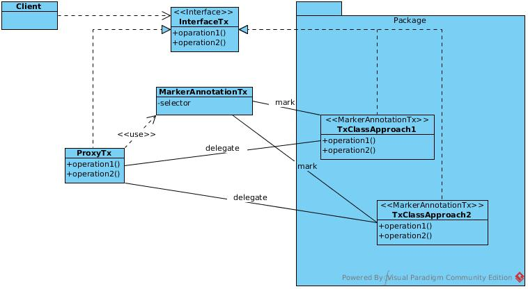
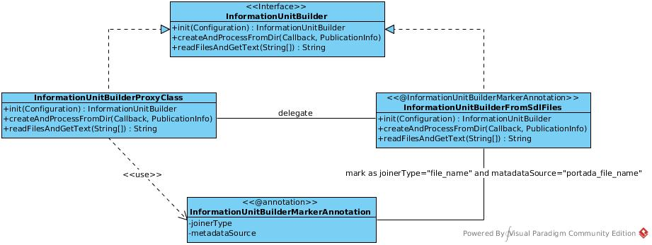
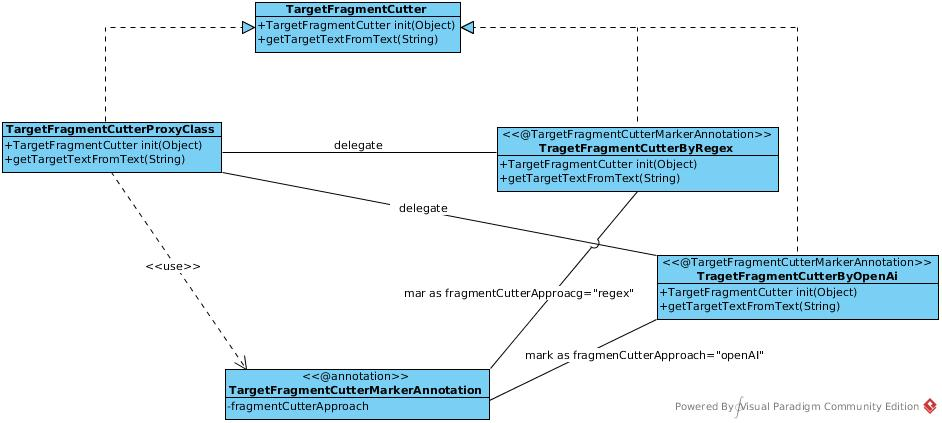
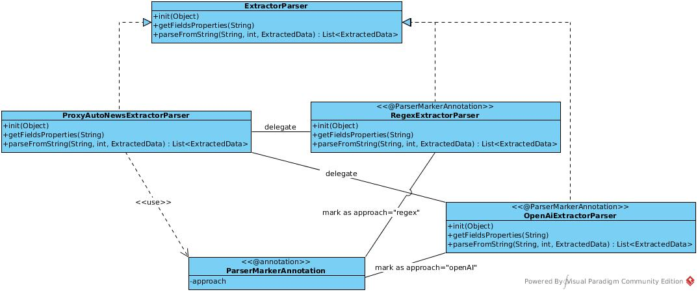
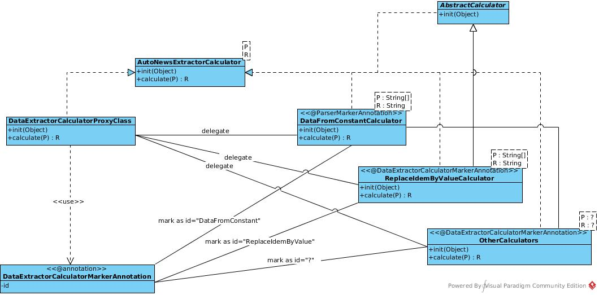
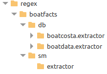
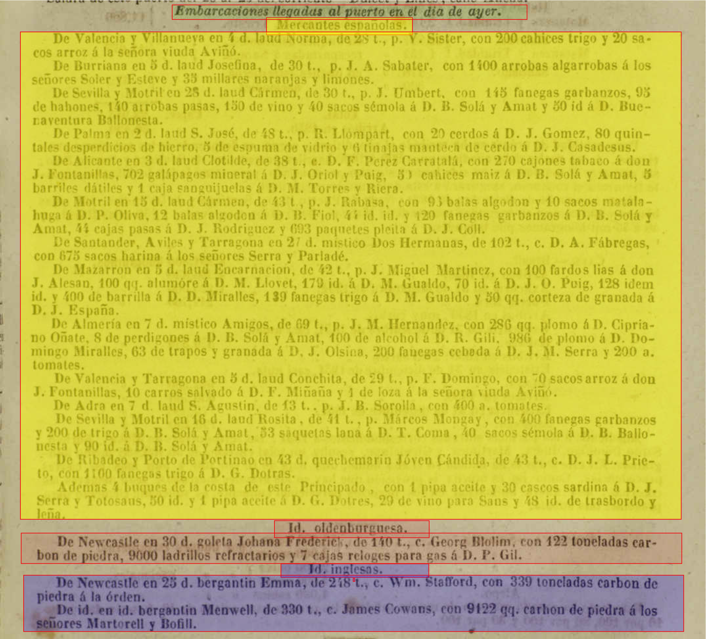
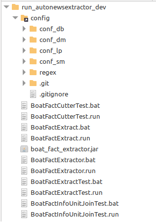

<div align="center">
<h1>Configuración para la extracción de datos</h1>
<h2>Manual para desarrolladores: Extracción de información de noticias en el contexto del proyecto portada</h2>
</div>

# Manual para desarrolladores

Este manual se ha creado básicamente para ayudar a los desarrolladores del proyecto **_PorTAda_** a crear los archivos de configuración necesarios para que las aplicaciones PAPI y PAPCLI puedan extraer los datos referentes a las embarcaciones llegadas a los diferentes puertos de estudio referenciadas en los periódicos utilizados como fuentes en el contexto del proyecto portada. 

Para facilitar la configuración de los extractores, se ha desarrollado una aplicación no integrada en PAPICLI de uso exclusivo para desarrolladores. Se puede conseguir en el enlace [autoNewsExtractorDev.zip](https://drive.google.com/file/d/1UBCOwoWMHVPY9bpfrQbXnQQh5WSmgjz4/view?usp=sharing). Dicho enlace solo contiene los ejecutables y scripts para preparar la extracción, por lo que será necesario añadir los directorios de configuración.  El código de dicha aplicación se encuentra en el siguiente repositorio de Github: *[jportada_boat_fact_extractor](https://github.com/portada-git/jportada_boat_fact_extractor)*. 

Antes de entrar en detalle sobre la cuestión práctica de la configuración de los extractores, se dará una explicación de la biblioteca en la que se ha basado la aplicación de extracción. Se trata de *[jportada_auto_news_extractor_lib](https://github.com/portada-git/jportada_auto_news_extractor_lib)*.

# La Biblioteca _jportada_auto_news_extractor_lib_

La biblioteca *[jportada_auto_news_extractor_lib](https://github.com/portada-git/jportada_auto_news_extractor_lib)*, es una biblioteca genérica para facilitar la creación de utilidades orientadas a la extracción de datos de fuentes textuales. Presenta una gran flexibilidad, lo que supone minimizar la creación de nuevo código. A continuación valor a presentar 3 funcionalidades que serán útiles para realizar la extracción en el contexto del proyecto portada.

## Funcionalidades de *jportada_auto_news_extractor_lib*
### Ensamblador de archivos digitales

Esta funcionalidad permite unir, en un solo archivo, los múltiples textos pertenecientes a una misma unidad informativa, que el procesador OCR haya generado a partir de los periódicos digitalizados. Aunque la biblioteca permitiría usar otras metodologías, en el proyecto **_PortAda_** se decidió usar el enfoque basado en el nombre de los archivos generados por el procesador OCR. Durante el proceso de obtención del texto a partir de las imágenes de los periódicos analizados, las imágenes se fraccionan en bloques para facilitar su ordenación y transcripción textual. En el proyecto se ha optado por nombrar cada bloque con un nombre que permita identificar la fecha, el nombre del periódico, la edición del ejemplar (mañana, tarde, ...), así como el tipo de noticia, la página y el número de bloque procesado por el OCR. 

Este formato nos permite determinar que todos los archivos de texto pertenecientes a una misma fecha, periódico, y edición, pueden contener información relacionada de una misma unidad de información y, por tanto, necesitamos unirla en un solo texto para poder disponer de un texto bien ordenado. 

Además, al tiempo que se realiza la unión, se consigue obtener información extra que no se encuentra en la noticia, objeto de nuestro análisis y posterior extracción. No referimos a los datos indicados en el nombre: Fecha del ejemplar, lugar de edición, nombre del periódico, edición del ejemplar y páginas de las que se realizará la extracción. Dicha información será incorporada, al resto de datos extraídos. Por ello **es importante que los nombres de los archivos sigan el patrón descrito: AAAA_MM_DD_PUE_NP_E_PG_BLOC.txt, donde AAAA corresponde al año de edición, MM al mes y DD al día;  PUE indica el nombre del puerto al que hace referencia la noticia a extraer (BCN, BUE, HAB, MAR); NP se refiere al nombre del periódico (DB por diario de Barcelona, DM por diario de la marina, EN por el nacional, LP por la prensa, SM por le semafore de Marseille, ...); E indica la edición del ejemplar (M por mañana, T por tarde, N por noche o U por única); la posición PG, contendrán el número de página, con dos dígitos de manera obligatoria, y los últimos 4 dígitos (BLOC) indicarán el número del bloque del que se ha transcrito el texto. Por ejemplo, el archivo 1854_04_25_BUE_EN_U_E_08_005.txt indicaría que se trata del quinto bloque de la página 8 de las noticias referidas a las entradas de buques al puerto de Buenos Aires del periódico _El Nacional_ de la única edición del día 25 de abril de 1854.

### Cortador de los fragmentos objetivo 
Una vez unidos todos los bloques en un único cabe segregar el texto objetivo donde se encuentra la noticia o sección de la cual extraer la información del resto de texto. Esta funcionalidad de búsqueda y segregación de los fragmentos-objetivo de estudio,  Para ello, en el proyecto PortAda se usará el enfoque basado en expresiones regulares que delimiten el inicio y el final de la sección. La composición de estas expresiones regulares sigue la metodología usada por la biblioteca _jportada_auto_news_extractor_lib_ que se explicará más adelante. El objetivo de esta funcionalidad consiste en reducir las posibilidades de error en el momento de realizar la extracción, eliminando de forma previa los fragmentos de noticias y secciones ajenas a la información que se quiere extraer. De esta forma, el proceso de extracción se hará únicamente con el texto necesario, evitando así, posible ruido que pueda falsear e inducir a error de los datos extraídos.

### Analizador para extraer la información
La última de las funcionalidades tiene como objetivo extraer los datos contenidos en el texto de las noticias, clasificándolo en categorías predefinidas a las que llamaremos campos. Estos son:

__model_version__: Indica la versión del nombre del campo model.

__publication_date__: Muestra la fecha del periódico

__publication_name__: Muestra el nombre del periódico

__publication_edition__: Indica la edición del periódico en caso de que haya más de una al día: M para mañana, T para tarde o N para noche. En caso de que haya una sola edición el valor será U (única).

__fact_type__: Es el tipo de noticia que se analiza. Puede tomar valores como E para entradas de buques o M para manifiestos de descarga.

__ship_departure_port__: Indica el puerto de salida del buque en este viaje

__ship_arrival_port__: Indica el puerto de llegada (Marsella, Buenos Aires, La Habana o Barcelona) del buque en este viaje. En la mayoría de los casos, esta información no aparece en las noticias y se deduce implícitamente según el periódico

__ship_departure_date__: Indica la fecha de salida del barco del puerto de salida

__ship_arrival_date__: Indica la fecha en la que el barco llegó al puerto de llegada (Marsella, Buenos Aires, La Habana o Barcelona)

__travel_arrival_moment_value__: Indica la hora de llegada al puerto. Puede expresarse como hora de llegada o como un periodo más amplio (mañana, tarde, noche, ...)

__ship_travel_time__: Indica el tiempo que el barco estuvo viajando desde el puerto de salida al puerto de llegada días u horas

__ship_travel_time_unit__: Indica la unidad de tiempo en la que se expresa la duración.

__ship_port_of_call_list__: Indica la lista de puertos (y opcionalmente más información como fechas de llegada o salida) en los que el barco había hecho escala durante su trayecto al puerto de llegada. Si la información de esta lista es solo el nombre de los puertos, la lista estará compuesta por nombres de puertos separados por comas. En caso contrario, cada información de escala se encerrará entre paréntesis cuadrados separados, también por comas, y dentro de cada uno de ellos se especificaran si fuera posible: el nombre del puerto, la fecha de llegada a ese puerto y la fecha de salida (de acuerdo a los 3 campos siguientes). 

__ship_port_of_call_place__: Muestra el nombre del puerto de un elemento de la lista de puertos de escala

__ship_port_of_call_arrival_date__: Muestra la fecha de llegada de un elemento de la lista de puertos de escala

__ship_port_of_call_departure_date__: Muestra la fecha de salida de un elemento de la lista de puertos de escala

__ship_type__: Describe el tipo de barco (bergantín, goleta,  vapor, etc.) que menciona el periódico

__ship_flag__: Hace referencia al nombre del país o región de la bandera del barco descrito por el periódico

__ship_name__: Indica el nombre del barco que normalmente se presenta completo, como se menciona en la fuente del periódico

__ship_tons__: Especifica la capacidad del barco en toneladas presentada como un valor numérico con la unidad de medida. En el caso de los barcos, esto siempre es lo mismo, ya que se refiere al tonelaje del buque. Este dato se da normalmente con abreviaturas como "ton." o "t."

__ship_master_role__: Hace referencia a la categoría de la persona que comanda el buque. Puede ser capitán o patrón, aunque en algunos casos también aparece piloto. Las abreviaturas que se utilizan para designarlos suelen ser “c” y “p”, respectivamente

__ship_master_name__: Es la identificación nominal de la persona que comanda el buque. Puede aparecer de varias formas, al menos lleva el apellido, precedido de su cargo (rol). Indica el apellido del capitán del buque, a menudo precedido de “cap.” o “c.”

__ship_agent__: Esta información puede indicar tanto el agente del buque, es decir, la persona que se encarga de las transacciones y la operación del buque, como el armador, es decir, la persona que es propietaria del buque o de parte del mismo. En ocasiones también puede hacer referencia al armador

__ship_crew__: Es el valor numérico de la tripulación del buque.

__ship_cargo_list__: Es la descripción de la lista con la información relativa a toda la carga transportada por el buque entrante (tipo de carga, cantidad, persona receptora de la carga, si la hay o “a la orden” en caso contrario, etc.). Inicialmente, se mostrará como descripción textual separada por comas, pero en una segunda fase, cada mercancía se descompondrá en los 6 siguientes campos.

__cargo_merchant__: Es la persona a la que iba destinada la carga, muchas veces será el comerciante que la había comprado y que se hizo cargo de ella en el momento de la descarga. Indica el destinatario de la carga, con ocasional mención a “divers” [varios/diversos].
En este caso vemos nombres de personas o empresas. Estos nombres tienen las mismas características y dificultades que el resto de denominaciones. En ocasiones los barcos llegaban a carga completa y estaban destinados a la misma persona, y en otros casos, cada carga tenía su destinatario. También aparece con frecuencia la expresión “a la orden”, que en principio es una carga para ser vendida a su llegada a puerto y que, por el contrario, no tiene un propietario anterior, más allá del propio capitán personalmente o por cuenta de alguien.

__cargo_type__: Expresa los productos o tipos de mercancías que han llegado. Es un valor muy variable, las mercancías más habituales son el carbón o el algodón, pero existe una extraordinaria diversidad de productos que llegan al puerto.

__cargo_value__: Expresión numérica del importe de la carga

__cargo_unit__: Expresa las unidades en las que aparece la carga. Estas pueden ser unidades de peso, volumen, recuentos o unidades relativas al embalaje.

__cargo_origin__: Puerto de origen de la carga

__cargo_destination__: Puerto de destino de la carga

__ship_quarantine__: Información relativa a condiciones especiales de la llegada motivadas por circunstancias sanitarias.

__ship_forced_arrival__: Indicación sobre las causas de la llegada forzosa

__ship_amount__: Este campo aparece únicamente en modelos cuantitativos donde, en lugar de especificar la información de cada buque, se indica el número de buques que han llegado o están a punto de llegar. Normalmente, se trata de un modelo específicamente pensado para el transporte de cabotaje.

__ship_origin_area__: Este campo aparece únicamente en modelos cuantitativos donde, en lugar de especificar la información de cada buque, se utiliza la zona de origen o de transporte. Normalmente, se trata de un modelo específicamente destinado al transporte de cabotaje.

En este caso existirán dos enfoques metodológicos para realizar la extracción, seleccionables mediante un atributo en el fichero de configuración (ver el apartado de configuración).  Uno de ellos estará basado en expresiones regulares (compuestas también siguiendo la metodología usada por la biblioteca _jportada_auto_news_extractor_lib_ que se explicará más adelante). El otro enfoque se basará en el uso de inteligencia artificial generativa (concretamente OpenAI).  

## Diseño de software basado en proxies
La biblioteca *[jportada_auto_news_extractor_lib](https://github.com/portada-git/jportada_auto_news_extractor_lib)* se ha diseñado para permitir diversos enfoques metodológicos en el tratamiento de la extracción. A fin de facilitar el desarrollo de los enfoques actuales y permitir futuras alternativas, la biblioteca dispone de un conjunto de proxies capaces de manejar, de forma transparente, múltiples enfoques que respondan a una funcionalidad determinada, organizada alrededor de una interfaz.



Se ha implementado 4 patrones diferentes de tipo proxy. Uno para cada funcionalidad (ensamblaje de archivos, segregación de fragmentos-objetivo y analizador de contenido) y un cuarto sistema para gestionar los llamados calculadores de campos. Al iniciarse la ejecución, cada proxy busca entre un conjunto definido de  paquetes, las classes anotadas por la anotación de marcaje asociada al proxy. Al iniciarse la ejecución, el proxy usará su anotación asociada para  encontrar todas las classes que implementen la interficie vinculada al proxy y así gestionar la delegación de las peticiones de los clientes en función de un parámetro de selección (el enfoque).

### Sistema del proxy para la funcionalidad de ensamblaje de archivos
En este caso solo se ha implementado un único enfoque específico para el proyecto PortAda, aunque en un futuro podrían implementarse otros. El patrón está basado en un _Proxy_ anotado por _InformationUnitBuilderMarkerAnnotation_ que implementa la interfaz _InformationUnitBuilder_ por delegación sobre la clase _InformationUnitBuilderFromSdlFiles_ (ver diagrama).



### Sistema del proxy para la funcionalidad de segregación de fragmentos-objetivo
De forma similar a la anterior, este sistema dispone de un Proxy anotado por _TargetFragmentCutterMarkerAnnotation_, implementa la interfaz _TargetFragmentCutter_ y delega en las classes _TargetFragmentCutterByRegex_ y _TargetFragmentCutterByOpenAI_tal como se muestra en el siguiente diagrama:



### Sistema del proxy para la funcionalidad de analizador de contenido para la extracción de datos
En este caso, el sistema dispone de un Proxy anotado por _ProxyAutoNewsExtractorParser_, implementa la interfaz _ExtractorParser_ y delega en las classes _RegexExtractorParser_ y _OpenAiExtractorParser_ tal como se muestra a continuación:



### Sistema del proxy para las utilidades FieldCalculator

Las utilidades FieldCalculator están diseñadas para facilitar la manipulación y cálculo de campos extraídos o no,  a partir de un conjunto de datos llegados a través de la configuración y los  parámetros durante la ejecución del cálculo. El diagrama UML ayuda a entender el diseño:



A fin de facilitar todas las posibles inicializaciones de modo automatizado, estas, se vinculan a una clase _Enum_ la cual contiene el identificador para cada uno de los argumentos usados en una inicialización. Actualmente, es posible inicializar con los siguientes datos:

 1. *config*. En este caso el calculador se inicializa con un objeto de tipo *Configuration*. En el caso del proyecto PorTAda un objeto de tipo *AutoNewsExtractorConfiguration* con todos los parámetros necesarios para gestionar la extracción de las noticias de *barcos entrados a puerto*.  Desde el calculador, se accede al objeto *Configuration* de la inicialización, mediante el método *getInitData("config")*.
 2. *parserId*. Este argumento de inicialización es de tipo *Integer*, e indica cuál de los múltiples analizadores de contenido para la extracción se está usando en este momento. A menudo la extracción pude contener diversos patrones diferentes dentro de una misma sección o noticia. Por ello se pueden usar diferentes analizadores en cada proceso de extracción. Estos se definen en la configuración (*AutoNewsExtractorConfiguration*) mediante una lista de candidatos. El valor *parserId* indica cuál de ellos se encuentra activo en el momento de procesar este cálculo.  Desde el calculador, se accede al valor entero pasado durante la inicialización, mediante el método *getInitData("parserId")*.
 3. *constants*. Esta opción permite inicializar el calculador con un conjunto de valores constantes en formato de objeto JSON. Se accede al objeto JSON con los valores de las constantes accediendo al método *getInitData("constants")*.
 4. *extracted_data*. Esta opción solo debería usarse en casos muy específicos. De hecho, los valores de los datos extraídos se pasan, ya sean los actuales o los previos, se pasan a través de parámetros en la llamada al método *calculate* pues ello permite pasar solo el valor y evitar manipulaciones en los datos extraídos. Sin embargo, cuando un objeto calculador deba realizar varias manipulaciones en diferentes campos, resulta útil pasar los datos extraídos (se inicializan pasándolos por referencia) para poder realizar todos los cambios con un solo calculador en lugar de tener que implementar un calculador para cada campo a cambiar. 

El método calculate, puede recibir un parámetro con un objeto, a lista que contenga todos los datos necesarios. Por ejemplo, el calculador llamado *ReplaceIdemByValueCalculator* recibe un array de cadenas de caracteres con dos posiciones, en la primera se enviará el valor actual del campo que se desea manipular en caso de que contenga la palabra* idem* o equivalente. Puesto que ello significa que el valor de eses campo, en realidad hace referencia al último valor obtenido para ese mismo campo durante la anterior extracción. Dicho valor se pasa como segunda posición del array.  La mayoría de calculadores no están diseñados para manipular directamente los campos (a excepción de los que se inicialicen con el parámetro *extracted_data* como ya se ha indicado) sino únicamente para calcular el valor de manera que por configuración se pueda asignar el valor al campo preciso. Esto permite reutilizar los calculadores genéricos en múltiples ocasiones (ver el apartado Configuracion para conocer como configurar este sistema de cálculo). 

## Configuración
La biblioteca _jportada_auto_news_extractor_lib_ dispone de diversos sistemas de configuración, los cuales se complementan entre sí. El sistema se inicializa argumentos pasados desde el sistema y también mediante un fichero típico de configuración (ini, properties, ...) el cual contiene en cada línea el nombre de un atributo junto a su valor separado por ":".  Por otro lado, la biblioteca, para aquellos enfoques basados en expresiones regulares, dispone de un conjunto de carpetas y ficheros donde se pueden definir, de forma parcial, expresiones regulares que podrán aprovecharse en la composición de expresiones más complejas. A este tipo de configuración la llamaremos _conjunto de expresiones regulares_ y generalmente se ubicará en el directorio "regex", aunque existe un atributo de configuración inicial que pude asignar otra ubicación. Existe todavía un tercer sistema de configuración específico para definir la extracción. Tiene formato JSON y generalmente se encuentra en un archivo llamado _extractor_config.json_, pero de nuevo, desde la configuración inicial, puede especificarse el nombre y ruta donde se ha ubicado. 

Seguidamente, describiremos con más detalles estos 3 sistemas  de configuración.

### Inicialización o configuración inicial
 El sistema se inicializa mediante argumentos pasados desde el sistema y también mediante un fichero típico de configuración (ini, properties, ...) el cual contiene en cada línea el nombre de un atributo junto a su valor separado por ":".  Por defecto, la biblioteca busca un fichero llamado _init.properties_ en el directorio de ejecución o en el subdirectorio llamado _config_, pero se le puede pasar otra ubicación usando el argumento -c [RUTA_INIT_PROPERTIES] desde el sistema. Casi todos los atributos permitidos en el fichero se pueden pasar usando el sistema (consola). De esta forma se puede decidir qué argumentos se pasan desde el fichero y qué otros desde el sistema. En caso de que se pasaran argumentos repetidos por fichero y consola, estos últimos tendría siempre prioridad sobre los definidos en el fichero. Desde la consola los atributos a pasar son:

**-h**, **--help** show this help message and exit
 
**-c** *[INIT_CONFIG_FILE]*, **--init_config_file** *[INIT_CONFIG_FILE]*  Camino donde se encuentra el archivo de configuración  (default: config)
 
**-d** *[ORIGIN_DIR]*, **--origin_dir** *[ORIGIN_DIR]*  Directorio de dónde leer los archivos OCR con las  noticias
 
**-o** *[OUTPUT_FILE]*, **--output_file** *[OUTPUT_FILE]*  Camino al archivo de salida. Por ejemplo: -o c:  /directorio/nombre_archivo
 
**-a** *[APPENDOUTPUTFILE]*, **--appendOutputFile** *[APPENDOUTPUTFILE]*  Indica si se desea añadir los barcos extraídos al final del archivo de salida o se crea un nuevo  archivo en cada extracción. Solo acepta los valores  '[s]i', '[y]es', '[c]ert', '[t]rue' como verdaderos. El resto de valores se consideran falsos.
 
**-x** *[FILE_EXTENSION]*, **--file_extension** *[FILE_EXTENSION]*  Indica qué extensión deben tener los archivos en  leer
 
**-r** *[REGEXBASEPATH]*, **--regexBasePath** *[REGEXBASEPATH]*  Directorio donde se encuentran especificadas las  expresiones regulares del análisis 
 
**-f** *[FACT_MODEL]*, **--fact_model** *[FACT_MODEL]* Indica qué tipo de hecho o noticia que se deberá analizar. En el caso del proyecto PorTAda, el tipo de hecho es _boatfacts_.
 
**-n** *[NEWSPAPER]*, **--newspaper** *[NEWSPAPER]* Indica qué nombre del periódico usado para extraer la notícia (db, sm, lp, dm, en, ...).
 
**-oe** *[OCR_ENGINE_MODEL]*, **--ocr_engine_model** *[OCR_ENGINE_MODEL]* Permite indicar qué modelos de expresiones regulares es necesario aplicar, en caso de que el motor OCR se comporte de manera específica.
 
**-p** *[PARSE_MODEL]*, **--parse_model** *[PARSE_MODEL]*  Indica qué modelos de analizador (parser) es necesario usar. Esto es, un nombre identificador del tipo de patrón con el que está escrita la noticia a extraer.
 
**-pcf** *[PARSER_CONFIG_JSON_FILE]*, **--parser_config_json_file** *[PARSER_CONFIG_JSON_FILE]* Indica cuál es el archivo JSON de configuración del exctractor.

**-tfb_pck** *[TARGET_FRAGMENT_BREAKER_PROXY_PACKAGES_TO_SEARCH]*, **--target_fragment_breaker_proxy_packages_to_search** *[TARGET_FRAGMENT_BREAKER_PROXY_PACKAGES_TO_SEARCH]* Indica en qué paquetes el proxy buscará los distintos enfoques de los segregadores de fragmentos-objetivo. 

**-iub_pck** *[INFORMATION_UNIT_BUILDER_PROXY_PACKAGES_TO_SEARCH]*, **--information_unit_builder_proxy_packages_to_search** *[INFORMATION_UNIT_BUILDER_PROXY_PACKAGES_TO_SEARCH]* Indica en qué paquetes el proxy buscará los distintos enfoques de los constructores de unidades de información. 

**-dex_pck** *[DATA_EXTRACT_PROXY_PACKAGES_TO_SEARCH]*, **--data_extract_proxy_packages_to_search** *[DATA_EXTRACT_PROXY_PACKAGES_TO_SEARCH]* Indica en qué paquetes el proxy buscará los distintos enfoques de los extractores de información. 
 
**-decb_pck** *[DATA_EXTRACT_CALCULATOR_BUILDER_PACKAGES_TO_SEARCH]*, **--data_extract_calculator_builder_packages_to_search** *[DATA_EXTRACT_CALCULATOR_BUILDER_PACKAGES_TO_SEARCH]* Indica en qué paquetes el proxy buscará las distintas clases de calculadores de campos. 
 
**-fbapp** *[FRAGMENT_BREAKER_APPROACH]*, **--fragment_breaker_approach** *[FRAGMENT_BREAKER_APPROACH]*  Indica qué enfoque metodológico se usa para separar los fragmentos-objetivo. Actualmente, solo en enfoque "regex" (basado en expresiones regulares) se encuentra implementado.
 
**-exapp** *[EXTRACTOR_APPROACH]*, **--extractor_approach** *[EXTRACTOR_APPROACH]*  Indica qué enfoque metodológico se utiliza para
 hacer la extracción. Actualmente, solo en enfoque "regex" (basado en expresiones regulares) se encuentra implementado.
 
**-rd** *[RUN_FOR_DEBUGGING]*, **--run_for_debugging** *[RUN_FOR_DEBUGGING]* Indica si es necesario ejecutar el proceso en modo  depuración o en modo normal. Los valores: '[s]i', '[y]es', '[c]ert', '[t]rue', '[v]ertader' se toman como valores ciertos, cualquier otro valor se considerará falso.

En el fichero de configuración se admiten todos los argumentos aceptados por consola en su versión larga. Además, dicho fichero acepta otros parámetros relativos al sistema de registro (logs).

### conjunto de expresiones regulares
A fin de poder generar expresiones regulares complejas, la biblioteca _jportada_auto_news_extractor_lib_ permite definir múltiples ficheros con expresiones regulares parciales que pueden ser usadas para componer nuevas expresiones regulares, las cuales podrían ser usadas de nuevo, recursivamente, como componentes de otras expresiones. 

#### Composición de expresiones regulares complejas

Una expresión compuesta podría ser: 
```
^(.*{##embarcaciones##} {##llegadas##} .{2,7} {##puerto##}.{8,25})\s+$
``` 
Esta expresión buscaría el contenido del fichero _embarcaciones.regex_ y reemplazaría la posición ocupada por `{##embarcacione##}` con el contenido encontrado en el fichero. También buscaría el fichero _llegadas.regex_ y el fichero _puerto.regex_ realizando la misma operación de reemplazo. 

Imaginemos que el fichero _embarcaciones.regex_ contuviera la expresión:
```
[EA]{2,3}barca.{2,4}nes
``` 
Que el contenido de _llegadas.regex_ fuera:
```
(?:(?:[|i¡l][|i¡l])|(?:[UHN]))[eoa]g[aoeu]d..

``` 
Y el de _puerto.regex_ fuera:
```
p[uo][eo]rt[oe]
``` 

La expresión final conseguida con el ejemplo anterior sería:
```
^(.*[EA]{2,3}barca.{2,4}nes (?:(?:[|i¡l][|i¡l])|(?:[UHN]))[eoa]g[aoeu]d.. .{2,7} p[uo][eo]rt[oe].{8,25})\s+$
``` 

#### Directorios de búsqueda de los archivos de expresiones regulares

Cabe tener en cuenta que la biblioteca _jportada_auto_news_extractor_lib_ dispone de un sistema de búsqueda del los archivos (.regex) con las expresiones a sustituir, bastante flexible. Estos archivos se encuentran ubicados en diversos directorios ramificados a partir de un directorio raíz de manera que forman una estructura jerárquica. 



Dicha jerarquía, actualmente está pensada para tener 4 niveles de profundidad a partir de la raíz. El directorio raíz representaría el nivel 0 y en él se ubicarían archivos con expresiones regulares muy genéricas, las cuales puedan usarse como componentes de otras expresiones de extracción en cualquier tipo de noticias; por ejemplo, la expresión regular para identificar la palabra "idem" o equivalente, o quizás, la expresión ampliada del concepto dígito para textos OCR de baja calidad. El primer nivel hace referencia al tipo de hecho o noticia (en el caso de portada "*boatfacts*"). Allí, deberíamos encontrar expresiones regulares para usar como componentes de otras más complejas, las cuales (las primeras) se consideren específicas del tipo de noticias, pero suficientemente genéricas  como para poderlas compartir entre distintas noticias del mismo tipo pero de distintos periódicos. Por  ejemplo, la expresión regular que define la palabra "*embarcaciones*" podría, seguramente,  ser reutilizada en múltiples noticias de entradas o salidas de barcos indistintamente del periódico donde estuvieran escritas. El siguiente nivel representa el periódico (db, dm, en, lp, sm, ...) y en él se ubican expresiones específicas para un tipo de noticia de un periódico determinado. Por ejemplo, si en el Diario de Barcelona (db) las banderas de los barcos que rezan a continuación de la primera suelen empezar por la palabra "idem" seguida de la nacionalidad (idem francesas, idem inglesas, ...) donde idem hace referencia al propósito de las embarcaciones de la primera bandera (generalmente "mercantes españolas"), parece razonable que este periódico y no otro disponga de una expresión regular para descubrir la palabra idem solamente si se encuentra en el principio de línea y si va seguida de una única palabra. El tercer nivel de profundidad permite definir: o bien expresiones regulares muy específicas del modelo de extractor a utilizar, o bien las expresiones regulares iniciales a partir de las cuales el sistema montará la expresión regular compleja, sustituyendo recursivamente los componentes que cada una de ellas pudiera tener. Las expresiones regulares iniciales deberán tener también un archivo con el mismo nombre i extensión *.options* donde se definirán las opciones (banderas) de proceso de la expresión regular final. Las opciones, siguiendo las notaciones estandardizadas de las expresiones regulares, se indican con una letra y pueden tomar uno o más valores de la siguiente colección; g (búsqueda global), m (búsqueda multilínea), i (búsqueda sin distinguir entre mayúsculas o minúsculas - case **i**nsensitive), s (búsqueda de saltos de línea incluidos, se toma toda la cadena como si fura una línea única), U (la búsqueda soporta los caracteres unicode), u (si está marcada la bandera i, los caracteres unicode especiales se buscan también sin tener en cuanta las mayúsculas o minúsculas).

El sistema es capaz de encontrar el nombre de un archivo con extensión .regex o .options, se encuentre donde se encuentre dentro de la jerarquía definida a partir del directorio raíz. Además, la búsqueda se realiza de dentro a fuera, de manera que los más específicos se descubren antes que los más genéricos. De esta forma, aunque hubiera ficheros con nombres repetidos, el sistema encontraría primero siempre el más específico. Así, si un extractor de expresiones regulares tiene un componente que no se acaba de adaptar, puede crear otro con el mismo nombre en un nivel más profundo.

#### Expresiones regulares alternativas

El contenido de los ficheros .regex debe ser una expresión regular válida con dos excepciones: los componentes de sustitución que siempre tendrán el formato `{##nombre_archivo##}` y los saltos de línea, que al hacer la composición, se tomarán como  expresiones alternativas. Esto es, que un fichero conteniendo:

```
E[mn]b.*[eo][s5]
[EA]{2,3}barca.{2,4}nes
.{1,3}barc.{1,2}c[i¡Il1][oec]n[eosc]
``` 
Al resolverse se construiría la expresión compleja siguiente:
```
(:?E[mn]b.*[eo][s5])|(:?[EA]{2,3}barca.{2,4}nes)|(:?.{1,3}barc.{1,2}c[i¡Il1][oec]n[eosc])
```
Esta "sintaxis" facilita mucho la creación de expresiones regulares muy complejas usando las propiedades de la sustitución y la búsqueda descritas en loas apartados anteriores, con una mirada más "humana", en el sentido de comprender e interpretar rápidamente las diferentes partes de la expresión compleja.

### Conjunto de Prompts para OpenAI

[==TO DO ...==]

### Configuración de los extractores de contenido

Los extractores o analizadores de contenido para la extracción, se configurarán mediante un fichero JSON, cuya estructura permite gestionar la instanciación y ejecución  de uno a más extractores de algún enfoque válido ("regex" o "openAi") capaces de trabajar de forma coordinada con las clases de la biblioteca _jportada_auto_news_extractor_lib_ para obtener una lista con los datos extraídos de las noticias de un conjunto de archivos con el texto fruto de la transcripción OCR de las imágenes de los periódicos.

Como ya se ha comentado, a menudo, la información a extraer puede responder a más de un patrón textual dentro de una misma noticia, sección o periódico. Ello nos obliga a poder trabajar con más de un analizador (uno para cada patrón de texto allado). Por ejemplo, en el Diario de Barcelona, en la misma sección de embarcaciones llegadas conviven dos tipos de patrones textuales, aquellos que detallan las características del viaje, de la embarcación y la carga transportada, rezando con un patrón similar a "De [PUERTO_DE SALIDA] [, ESCALA[, ... [y ULTIMA_ESCALA]]] en [TIEMPO] [DIAS_HORAS], [TIPO_EMBARCACION] [NOMBRE_EMBARCACION]..." , y los que informa de las embarcaciones de cabotaje, que en lugar de detallar cada embarcación informan del número de barcos y la carga que llevan entre todos ellos. En este caso, el patrón textual es "Además [NUMERO_DE_EMBARCACIONES] buques de la costa de este principado se dirigen a puerto  con [DETALLE_DE_LA_CARGA]".  Al ser patrones tan diferentes, será necesario definirlos por separado.

En el atributo llamado "_parse_model_" del fichero de configuración (*init.properties*) debe detallarse la lista de analizadores para la extracción de los diferentes patrones, indicando los nombres de estos separados por coma. El nombre es solo un identificador y puede tomar cualquier valor. La única restricción es que deben coincidir los nombres definidos en el atributo  "_parse_model_", con las claves indicadas en el fichero de configuración JSON. Imaginemos que el atributo parse_model se encuentra definido como: `parse_model=[boatdata.extractor,boatcosta.extractor]` el fichero de configuración de los analizadores deberá contener estas dos claves y cada una de ellas describirá un objeto JSON con la configuración específica:
```json
{
    "boatdata.extractor": {
		    ...
    },
    "boatcosta.extractor": {
		    ...
    }
}   
```
La configuración de cada analizador de contenido para la extracción depende del enfoque que se defina, el cual, como se ha indicado, puede ser *regex* o *openAi*. 

#### Configuración de un  analizador de tipo *regex*

La configuración de cada analizador tiene formato de objeto JSON con los siguientes campos:
 - **field_version**:  Indica la versión de nombres de campos usada en esta configuración. Por ejemplo: 'boat_fact-00.00.00'".
 - **constants**: Es un objeto JSON con el conjunto de constantes (nombre de la clave y valor) necesarias para configurar este extractor o sus calculadores. Por ejemplo: 
```json
{
	"arrival_port": "Barcelona", 
	"puertos_por_id":{
		"BCN":"Barcelona", 
		"BUE":"Buenos Aires", 
		"HAV":"La Habana",
		"MAR":"Marsella"
	}
}
```
&nbsp; &nbsp; &nbsp; &nbsp; Como puede verse en el ejemplo, cada constante contener datos simples o  datos compuestos.
 - **config**: Este atributo tiene formato de _array_ y define múltiples niveles de extracción.

Veamos ahora qué significa definir múltiples niveles de extracción y como especificarlos. 

##### Relación jerárquica del contenido

En muchas ocasiones la información escrita mantiene cierta relación jerárquica. Por ejemplo, en la imagen siguiente se puede ver que la información del título hace referencia a todas las entradas de la sección. Así podemos afirmar que todas las entradas de las embarcaciones siguientes se produjeron el día anterior a la fecha de publicación del diario (ayer). Por otro lado, también podemos ver que bajo el subtítulo de mercantes españolas (resaltado en amarillo) se informan de un conjunto de entradas, todas ellas embarcaciones españolas, aunque en el texto no aparezca esa información. De hecho, deducimos que todas las embarcaciones resaltadas en amarillo son españolas, la resaltada en naranja es oldenburguesa y las de color azul inglesas.



Esta deducción responde a la estructura implícita en la distribución textual. Así podemos concluir que desde el primer subtítulo ("mercantes españolas" en el ejemplo) hasta el siguiente ("id. oldenburguesa") las embarcaciones comparten la bandera que se extraiga del subtítulo. Las que se encuentran  entre el segundo y tercer subtitulo, en cambio, comparten la bandera extraída del subtítulo ("oldenburguesas") y las que se encuentran debajo del tercer subtítulo hasta el final deberán ser "inglesas".

En este caso, se necesitará más de una expresión regular para analizar y extraer toda la información contenida en la sección. Por un lado, necesitaremos, al menos,  una expresión regular que identifique los subtítulos y extraiga la bandera y por otro, una expresión regular que identifique y extraiga el resto de información para el texto que quede entre subtítulo y subtítulo. En el caso del ejemplo, vamos a ver que solamente con dos tipos de expresiones tendremos suficiente para extraer toda la información. Por tanto,  el atributo *config* de fichero JSON deberá tener dos especificaciones, una para configurar la extracción de la información de los subtítulos y otra para configurar la extracción del texto situado entre subtítulos.

##### Configuración de cada nivel de extracción

Para cada uno de los extractores se deberá definir en un formato de objeto JSON las siguientes características:

 - **approach_type**: Permite indicar el enfoque del extractor. Admite 'regex' o 'openAi'. Es necesario clarificar que la siguiente configuración es específica para 'regex' pues la correspondiente a 'openAi' se muestra en el apartado relativo a la configuración de los extractores openAi.
 - **configuration**: es un objeto que contendrá la especificación siguiente: 
	 - **main_regex**: Nombre del archivo '.regex' inicial que originará toda la expresión de extracción final.
	 - **max_groups**: Este es un dato numérico e indica el número máximo de grupos que la expresión manejara. Como mínimo habría que indicar el número de campos que esta expresión obtiene, aunque, si la expresión principal necesita varias alternativas, el valor será un múltiplo del número de campos a extraer (número de campos * número de alternativas).
	 - **fields_to_extract**:  _Array_ con la especificación de la extracción de cada campo en el mismo orden que aparezcan en el texto
	 - **fields_to_calculate**: _Array_ con la especificación del cálculo a realizar de aquellos campos en que sea necesario.

Para cada campo a extraer (ítem de fields_to_extract), deberá indicarse:
 - **key**: Nombre de la categoría o campo que se dará al valor extraído en el grupo de la exterior regular correspondiente a la misma posición que esta definición tenga en el _array_ 'fields_to_extract'.
 - **temporary_field**: Indica si el nombre definido en 'key' será temporal o se corresponderá con alguno definidor en la versión del modelo de extracción identificado por 'field_version'.
 - **default_value**: Valor que queremos darle al campo en caso de que la expresión regular no sea capaz de identificar su valor. Este es importante para dar un valor específico en aquellos campos que se utilicen para calcular otros, a fin de evitar problemas en el procesamiento del cálculo, pero también es importante para asignar un valor que permita distinguir los campos no encontrados de los encontrados. Por ejemplo, "???" permitiría distinguir de un solo vistazo los campos encontrados de los no encontrados.
 - **copy_last_value**: Este atributo necesita un valor booleano (true/false) y permite reducir el número de extractores a añadir en 'config'. Un valor de true, indica que su valor se copiará a la siguiente extracción encontrada por la  expresión regular. Así, la información perteneciente al título principal, puede irse copiando al resto de su misma categoría sin necesidad de establecer  un extractor para la categoría superior.

Para cada campo a calcular (ítem de fields_to_calculate), deberá indicarse:
 - **calculator**: nombre que identifica el calculador para que el proxy pueda encontrarlo.
 - **key**:  nombre del campo donde volcará el valor calculado por este calculador. 
 - **temporary_field**: Indica lo mismo que su homónimo de "_ fields_to_extract_". En caso de que ya se haya definido anteriormente, no será necesario repetir aquí la información.
 - **init_data**: Este es un dato opcional. Si aparece debe tenar formato _array_. Indicará las múltiples inicializaciones que este calculador necesita. Serán valores válidos: "configuration", "parser_id", "constants" o "extracted_data" definidos en el apartado [Sistema del proxy para las utilidades FieldCalculator](https://github.com/portada-git/developers_portada_project_documentation/blob/main/ManualDesarrolladores.md#sistema-del-proxy-para-las-utilidades-fieldcalculator).
 - **fieldParams**: Este dato es opcional. Si aparece, debe pasarse los nombres de los campos de los que se quiera obtener su valor, precedidos de _extracted_data._ o _last_extracted_data._,  según se desee el valor recien extraido o el valor obtenido de la última extracción completa. Por ejemplo si se especifica `["extracted_data.master_role", "last_extracted_data.master_role"]`se pasará al calculador especificado, el rol del responsable obtenido en el proceso de extración (supongamos 'id.') y la misma categoría, pero cuyo valor fue obtenido en la extracción de la embarcación leída justo antes de la actual (supongamos 'cap.'). 
 - **literalParams**: Este dato es opcional y corresponderá a la lista de valores literales que se desee pasar como parámetros al calculador. Se acepta cualquier valor literal i se define en formato _array_. Por ejemplo: `["La Habana"].

##### Ejemplo de configuración completo
 
 Sirva de ilustración de lo descrito, el siguiente ejemplo de una configuración completa:
 ```json
 {
    "boatdata.extractor": {
        "field_version": "boat_fact-00.00.00",
        "constants": {"arrival_port": "Barcelona"},
        "config": [
            {
                "approach_type": "regex",
                "configuration": {
                    "max_groups": 15,
                    "fields_to_extract": [
                        {
                            "temporary_field": true,
                            "default_value": "y",
                            "copy_last_value": true,
                            "key": "time_of_arrival"
                        },
                        {
                            "temporary_field": true,
                            "default_value": "mercante",
                            "copy_last_value": true,
                            "key": "purposeType"
                        },
                        {
                            "default_value": "????",
                            "copy_last_value": false,
                            "key": "ship_flag"
                        }
                    ],
                    "fields_to_calculate": [
                        {
                            "calculator": "TimeOfArrivalRelativeToPublicationCalculator",
                            "temporary_field": true,
                            "init_data": [
                                "configuration",
                                "parser_id"
                            ],
                            "fieldParams": ["extracted_data.time_of_arrival"],
                            "key": "time_of_arrival"
                        },
                        {
                            "calculator": "ElapsedTimeFromArrivalToPublicationCalculator",
                            "temporary_field": true,
                            "fieldParams": ["extracted_data.time_of_arrival"],
                            "key": "elapsed_days_from_arrival"
                        }
                    ],
                    "main_regex": "flag"
                }
            },
            {
                "approach_type": "regex",
                "configuration": {
                    "max_groups": 10,
                    "fields_to_extract": [
                        {
                            "default_value": "????",
                            "copy_last_value": false,
                            "key": "ship_departure_port"
                        },
                        {
                            "default_value": "??",
                            "copy_last_value": false,
                            "key": "ship_travel_time"
                        },
                        {
                            "default_value": "?",
                            "copy_last_value": true,
                            "key": "ship_travel_time_unit"
                        },
                        {
                            "default_value": "????",
                            "copy_last_value": false,
                            "key": "ship_type"
                        },
                        {
                            "default_value": "????",
                            "copy_last_value": false,
                            "key": "ship_name"
                        },
                        {
                            "default_value": "????",
                            "copy_last_value": false,
                            "key": "ship_tons"
                        },
                        {
                            "temporary_field": true,
                            "default_value": "t.",
                            "copy_last_value": false,
                            "key": "ship_tons_unit"
                        },
                        {
                            "default_value": "????",
                            "copy_last_value": false,
                            "key": "ship_master_role"
                        },
                        {
                            "default_value": "????",
                            "copy_last_value": false,
                            "key": "ship_master_name"
                        },
                        {
                            "default_value": "????",
                            "copy_last_value": false,
                            "key": "ship_cargo_list"
                        }
                    ],
                    "fields_to_calculate": [
                        {
                            "calculator": "DataFromConstantCalculator",
                            "init_data": ["constants"],
                            "key": "ship_arrival_port",
                            "literalParams": ["arrival_port"]
                        },
                        {
                            "calculator": "PortOfCallsFromOriginPortCalculator",
                            "init_data": [
                                "configuration",
                                "parser_id",
                                "extracted_data"
                            ],
                            "key": "ship_port_of_call_list",
                            "literalParams": ["ship_departure_port"]
                        },
                        {
                            "calculator": "ReplaceIdemByValueCalculator",
                            "init_data": [
                                "configuration",
                                "parser_id"
                            ],
                            "fieldParams": [
                                "extracted_data.ship_travel_time",
                                "last_extracted_data.ship_travel_time"
                            ],
                            "key": "ship_travel_time"
                        },
                        {
                            "calculator": "ReplaceIdemByValueCalculator",
                            "init_data": [
                                "configuration",
                                "parser_id"
                            ],
                            "fieldParams": [
                                "extracted_data.ship_travel_time_unit",
                                "last_extracted_data.ship_travel_time_unit"
                            ],
                            "key": "ship_travel_time_unit"
                        },
                        {
                            "calculator": "ShipArrivalDateCalculator",
                            "fieldParams": [
                                "extracted_data.elapsed_days_from_arrival",
                                "extracted_data.publication_date"
                            ],
                            "key": "ship_arrival_date"
                        },
                        {
                            "calculator": "ShipDepartureDateCalculator",
                            "fieldParams": [
                                "extracted_data.ship_arrival_date",
                                "extracted_data.ship_travel_time",
                                "extracted_data.ship_travel_time_unit"
                            ],
                            "key": "ship_departure_date"
                        }
                    ],
                    "main_regex": "boat_fact"
                }
            }
        ]
    },
    "boatcosta.extractor": {
        "field_version": "boat_fact-00.00.00",
        "constants": {"arrival_port": "Barcelona"},
        "config": [
            {
                "approach_type": "regex",
                "configuration": {
                    "max_groups": 15,
                    "fields_to_extract": [
                        {
                            "temporary_field": true,
                            "default_value": "y",
                            "copy_last_value": true,
                            "key": "time_of_arrival"
                        },
                        {
                            "temporary_field": true,
                            "default_value": "mercante",
                            "copy_last_value": true,
                            "key": "purposeType"
                        },
                        {
                            "default_value": "????",
                            "copy_last_value": false,
                            "key": "ship_flag"
                        }
                    ],
                    "fields_to_calculate": [
                        {
                            "calculator": "TimeOfArrivalRelativeToPublicationCalculator",
                            "temporary_field": true,
                            "init_data": [
                                "configuration",
                                "parser_id"
                            ],
                            "fieldParams": ["extracted_data.time_of_arrival"],
                            "key": "time_of_arrival"
                        },
                        {
                            "calculator": "ElapsedTimeFromArrivalToPublicationCalculator",
                            "temporary_field": true,
                            "fieldParams": ["extracted_data.time_of_arrival"],
                            "key": "elapsed_days_from_arrival"
                        }
                    ],
                    "main_regex": "flag"
                }
            },
            {
                "approach_type": "regex",
                "configuration": {
                    "max_groups": 9,
                    "fields_to_extract": [
                        {
                            "default_value": "??",
                            "copy_last_value": false,
                            "key": "ship_amount"
                        },
                        {
                            "default_value": "??",
                            "copy_last_value": false,
                            "key": "ship_origin_area"
                        },
                        {
                            "default_value": "????",
                            "copy_last_value": true,
                            "key": "ship_cargo_list"
                        }
                    ],
                    "fields_to_calculate": [
                        {
                            "calculator": "DataFromConstantCalculator",
                            "init_data": ["constants"],
                            "key": "ship_arrival_port",
                            "literalParams": ["arrival_port"]
                        },
                        {
                            "calculator": "ShipArrivalDateCalculator",
                            "fieldParams": [
                                "extracted_data.elapsed_days_from_arrival",
                                "extracted_data.publication_date"
                            ],
                            "key": "ship_arrival_date"
                        }
                    ],
                    "main_regex": "unknown_boat_fact"
                }
            }
        ]
    }
}
```

#### Configuración de un  analizador de tipo *openAI*		

[==TO DO ...==]

# Preparación de la configuración 

Para empezar a configurar los extractores de los diferentes periódicos del _Proyecto PorTAda_ será necesario, o bien, bajarse la aplicación _autoNewsExtractorDev_ en el enlace [_autoNewsExtractorDev.zip_](https://drive.google.com/file/d/1UBCOwoWMHVPY9bpfrQbXnQQh5WSmgjz4/view?usp=drive_link) y descomprimir el archivo, o bien, clonar el repositorio [jportada_boat_fact_extractor](https://github.com/portada-git/jportada_boat_fact_extractor).  Es posible que no hayáis de implementar código alguno. En ese caso, la opción preferida debería ser  la descarga e instalación de la aplicación compilada. Sin embargo, en el caso de que la información contenida en vuestros periódicos requiera algún tipo de cálculo en alguno de vuestros campos a extraer, la mejor opción, entonces, sería la clonación del repositorio para poder añadir el código de vuestros calculadores.  De momento podéis empezar con la descarga de la aplicación y en caso de que necesitéis codificar alguna cosa, ya realizaréis la clonación a posteriori. 

## Instalación de _autoNewsExtractorDev_

 Para instalar la aplicación, una vez descargada desde el enlace [_autoNewsExtractorDev.zip_](https://drive.google.com/file/d/1UBCOwoWMHVPY9bpfrQbXnQQh5WSmgjz4/view?usp=drive_link) solamente se debe descomprimir el archivo descargado.  Esto creará el directorio "_run_autonewsextractor_dev_", dentro del cual se encontrara el archivo ejecutable (_boat_fact_extractor.jar_) y 10 scripts (5 para ejecutar bajo Windows y 5 bajo Linux/MAC) que ayudaran a realizar y probar la configuración que debéis realizar. 

Una vez descomprimido el archivo _autoNewsExtractorDev.zip_ y comprobado su contenido, será necesario configurar los directorios de configuración. Para facilitar esta tarea y evitar errores, se ha creado un repositorio en _Github_ llamado [ _portada_boat_fact_extractor_config_data_](https://github.com/portada-git/portada_boat_fact_extractor_config_data) en el que se han definido los directorios básicos y los principales ficheros a usar para cada uno de los equipos del proyecto. Se ha usado un repositorio de github con los directorios y ficheros porque la configuración final de cada equipo debe subirse al servidor del proyecto.

Así pues, deberéis clonar el repositorio _portada_boat_fact_extractor_config_data_ en vuestro ordenador local. Una vez clonado, moved y renombrad el repositorio local (recién clonado), con el nombre _config_, al directorio de ejecución del programa _autoNewsExtractorDev_ y que si no habéis renombrado, debería ser _run_autonewsextractor_dev_. El resultado de esta operación debería ser el que se muestra en la siguiente imagen:



Aseguraros que el directorio _config_ es vuestro repositorio local de _portada_boat_fact_extractor_config_data_, ya que así, se podrá sincronizar fácilmente y sin peligro los cambios que los diferentes equipos vayan realizando. 

# La aplicación _autoNewsExtractorDev_

La aplicación _autoNewsExtractorDev_ no tiene versión gráfica. Debe usarse desde la consola del sistema ejecutando cada un de los scripts, o directamente el ejecutable si la extensión _jar _ la tenéis asociada a la máquina virtual JAVA. El .jar esta compilado para ser ejecutado por la versión 11 o superior de la máquina virtual. Si disponéis de una máquina virtual de inferior versión actualizadla.

Los scripts que encontraréis en el directorio de instalación (_run_autonewsextractor_dev_) de la aplicación son:
 - *BoatFactInfoUnitJoinTest.run* / *BoatFactInfoUnitJoinTest.bat*. Este script permite configurar y testear la funcionalidad de "ensamblaje de los archivos digitales de una misma unidad informativa". Es necesario indicarle donde se encuentra el fichero de configuración (init.properties), el directorio con las fuentes de texto y el directorio donde se escribirán los nuevos ficheros ensamblados.  Para hacer el test se necesitan diversos archivos de varias unidades informativas, algunas de ellas compuestas por más de un archivo.
 - *BoatFactCutterTest.run* / *BoatFactCutterTest.bat*. Este script se puede usar para configurar y testear la funcionalidad de "recorte de los fragmentos-objetivo". Para probar será necesario configurar una expresión regular para detectar el inicio del fragmento y otra para detectar el final. Además, se necesitarán archivos de texto ya ensamblados conteniendo el fragmento-objetivo (las entradas de barcos y manifiestos) además de otros textos. Necesita que se le indique donde se encuentra el fichero de configuración, el directorio con los ficheros fuente y el directorio donde guardar los fragmentos segregados. Este proceso es independiente del anterior. Pueden usarse archivos arreglados manualmente o los devueltos por la funcionalidad de ensamblaje. 
 - *BoatFactExtractTest.run* / *BoatFactExtractTest,bat*. Este script está preparado para probar la extracción de datos de ficheros de texto con el contenido de las noticias de entradas de barcos y manifiestos. Para ello deberán configurarse las expresiones regulares pertinentes y el archivo JSON que lo gestiona. Se le deberá indicar donde se encuentra el fichero de configuración, el directorio con los ficheros fuente y el nombre base (sin extensión) del fichero donde escribirá los datos extraídos en un formato  JSON.
 - *BoatFactExtract.run* / *BoatFactExtract.bat*. Una vez probada cada una de las funcionalidades por separado, mediante este script es posible integrarlas todas ellas en un solo proceso. Requiere la indicación de la ubicación del fichero de configuración, el directorio fuente y el nombre base del fichero donde escribir la lista de resultados. 
 -  *BoatFactExtractorCommand.run* / *BoatFactExtractorCommand.bat*. Este es un script genérico que mediante un argumento extra permite ejecutar los  4 procesos anteriores. El argumento extra debe posicionarse en primer lugar y debe tener alguno de los siguientes valores: 'information_unit_test', 'cut_test', 'extract_test' o 'extract', Inmediatamente después del comando deberán especificarse los mismos argumentos usados para las diferentes funcionalidades según sea el caso.
 
 Finalmente, si la extensión '_.jar_' se encuentra asociada a la máquina virtual _java_, debería poder usarse directamente el ejecutable (_boat_fact_extractor.jar_) pasándole los mismos argumentos que los pasados al script anterior.

Los archivos de texto para realizar las pruebas deberán contener las noticias procesadas de manera que cada párrafo se encuentre escrito en una única línea. Los párrafos, títulos, cabeceras, números de página, etc. se encontrarán separados por un único salto de línea. 

## Configuración y prueba de la utilidad _BoatFactInfoUnitJoinTest_

Esta utilidad requiere de configuración muy simple y un banco de pruebas relativamente pequeño. No precisa de expresión regular alguna y al existir un único enfoque solo será necesario comprobar que el fichero "init.properties" contenga los siguientes atributos y valores:
 - **information_unit_builder_proxy_packages_to_search**=org.elsquatrecaps.autonewsextractor.informationunitbuilder.reader
 - **file_extension**=txt
 - **informationUnitBuilderType**=file_name
 - **metadataSource**=portada_file_name

En el directorio fuente colocar ficheros de texto con nombres que sigan el patrón definido en el apartado [Ensamblador de archivos digitales](#ensamblador-de-archivos-digitales). Es decir: AAAA_MM_DD_PUE_NP_E_PG_BLOC.txt. Con independencia del contenido, asegurad que disponéis de una variedad de nombres suficiente para probar las distintas posibilidades.

Argumentos de la ejecución:

 - **-c**: indicará el nombre y ubicación del fichero de configuración inicial. Per  ejemplo: `-c config/conf_db/init.properties`
 - **-d**: debe contener la ruta del directorio donde se encuentran los ficheros de texto a tratar. Ejemplo: `-d data_db`
 - **-o**: indica la ruta del directorio de salida donde se desea escribir los ficheros resultantes. Los ficheros de la entrada que no respondan al patrón esperado no se copiaran a la salida. Los ficheros con la misma fecha, periódico y edición, pero con distintas páginas o bloques, se unirán en uno solo con el nombre del fichero de página y bloque inferior, seguido del sufijo "__informationUnit_". Si no hay dos o más ficheros coincidentes, pero cumple el patrón esperado, se copiará al directorio de salida añadiendo el mismo sufijo. 
 
Si en el directorio de entrada tenemos los ficheros: 
 - 1852_01_01_BCN_DB_U_16_0001.txt
 - 1852_01_02_BCN_DB_U_06_0001.txt
 - 1852_01_02_BCN_DB_U_07_0001.txt
 - 1852_01_02_BCN_DB_U_07_0002.txt
 - aaaaa.txt

Al ejecutar esta utilidad en el directorio de salida obtendríamos los ficheros:

 - 1852_01_01_BCN_DB_U_16_001_informationUnit.txt
 - 1852_01_02_BCN_DB_U_06_001_informationUnit.txt

Ejemplo de ejecución:

`$ ./BoatFactInfoUnitJoinTest.run -c config/conf_db/init.properties -d text_db -o resultats/iu`

## Configuración y prueba de la utilidad _BoatFactCutterTest_

Esta utilidad necesita crear al menos dos ficheros con expresiones regulares. Dependiendo de los periódicos  se podrán necesitar 4. El objetivo de estas expresiones regulares consiste en detectar cuál es el inicio y el final del fragmento-objetivo de manera que se pueda dividir todo el texto de un periódico a tratar aislando el fragmento de interés y eliminando el resto. 

Los ficheros conteniendo las expresiones regulares se ubicarán en el directorio "config/regex" y seguirán la lógica descrita en el apartado [Conjunto de expresiones regulares](#conjunto-de-expresiones-regulares).  

### Detector del fragmento inicial

Deberá responder al nombre de "fragment_initial_detector" y al ser la expresión generadora necesitará de la extensión .regex, con la expresión deseada, y la extensión .options, con las opciones de procesamiento activas. Esta expresión deberá dividir el texto del fichero en  3 grupos:
 1. El primer grupo contendría el texto desde el inicio hasta justo antes, donde empieza el fragmento de interés.
 2. El segundo grupo contendrá una parte del texto de interés usada para detectar el inicio del fragmento, por ejemplo el título de la sección, algún subtítulo, etc.
 3. El tercer grupo contendrá el texto que vaya desde el final del fragmento de detección hasta el final del fichero.
 
 Veamos un ejemplo. En el Diario de Barclona 


