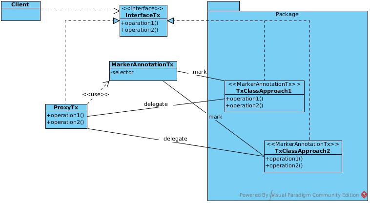
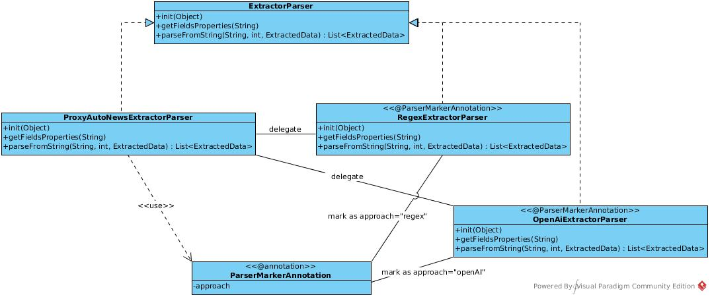
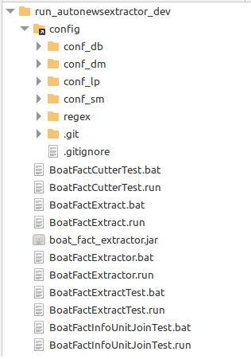

<div align="center">
<h1>Configuration for Data Extraction</h1>
<h2>Developer Manual: Extracting Information from News Articles for the PortAda Project</h2>
</div>

# Developer Manual

This manual is designed to assist developers in the **_PortAda_** project in creating the necessary configuration files for the **PAPI** and **PAPCLI** applications. These files enable data extraction related to vessels arriving at the different ports studied, as referenced in the newspapers used as sources for the project.

To streamline the configuration process for the extractors, a standalone application has been developed for exclusive use by developers. This application is not integrated into **PAPICLI** and can be accessed at the following link: [autoNewsExtractorDev.zip](https://drive.google.com/file/d/1UBCOwoWMHVPY9bpfrQbXnQQh5WSmgjz4/view?usp=sharing). The download contains only executables and scripts for preparation; configuration directories must be added separately. The application's source code is available on GitHub: *[jportada_boat_fact_extractor](https://github.com/portada-git/jportada_boat_fact_extractor)*.

Before diving into the practical aspects of configuring the extractors, this manual provides an overview of the library upon which the extraction application is built: *[jportada_auto_news_extractor_lib](https://github.com/portada-git/jportada_auto_news_extractor_lib)*.

# The Library _jportada_auto_news_extractor_lib_

The *[jportada_auto_news_extractor_lib](https://github.com/portada-git/jportada_auto_news_extractor_lib)* is a generic library designed to facilitate the creation of tools aimed at extracting data from textual sources. It offers great flexibility, minimizing the need for new code development. Below are three key functionalities of this library that are crucial for data extraction within the PortAda project.

## Features of _jportada_auto_news_extractor_lib_

### Digital File Assembler

This feature allows the merging of multiple text files belonging to the same informational unit generated by an OCR processor from digitized newspapers into a single file. Although the library supports other methodologies, the **_PortAda_** project opts for an approach based on the naming convention of files generated by the OCR processor.

During text extraction from newspaper images, the images are segmented into blocks to facilitate organization and transcription. The project uses a naming pattern for each block, which includes the publication date, newspaper name, edition (morning, afternoon, etc.), news type, page, and block number. This enables grouping of text files from the same date, newspaper, and edition into a single, ordered text file. Additionally, metadata such as the publication date, place of publication, newspaper name, edition type, and page numbers is extracted from file names and incorporated into the final data.

Files must follow the naming convention:  
`YYYY_MM_DD_PORT_NEWSPAPER_EDITION_PAGE_BLOCK.txt`, where:
- `YYYY` = Year of publication
- `MM` = Month
- `DD` = Day
- `PORT` = Port referenced in the news (e.g., BCN, BUE, HAB, MAR)
- `NEWSPAPER` = Newspaper abbreviation (e.g., DB for Diario de Barcelona)
- `EDITION` = Edition type (M = morning, T = afternoon, N = night, U = unique)
- `PAGE` = Page number (two digits)
- `BLOCK` = Block number processed by OCR (four digits)

Example:  
`1854_04_25_BUE_EN_U_E_08_005.txt`  
This file represents the fifth block on page 8 of news about vessel arrivals at the port of Buenos Aires, from *El Nacional*, published in a single edition on April 25, 1854.

### Target Fragment Cutter

Once all blocks are merged into a single text file, this feature extracts the target news fragment or section for analysis, separating it from unrelated content. For the PortAda project, this is achieved using regular expressions to define the start and end points of the relevant section. This step ensures that only the required text is processed, reducing noise that could introduce errors during data extraction.

### Analyzer for Data Extraction

This feature extracts and classifies information from the target text into predefined categories, referred to as *fields*. These fields include:

- **model_version**: Version of the model used for field naming.
- **publication_date**: Publication date of the newspaper.
- **publication_name**: Name of the newspaper.
- **publication_edition**: Edition type (e.g., morning, afternoon, unique).
- **fact_type**: News type (e.g., E for vessel arrivals, M for cargo manifests).
- **ship_departure_port**: Port of departure for the vessel.
- **ship_arrival_port**: Port of arrival for the vessel (e.g., Marseille, Buenos Aires, Havana, Barcelona). This information is often implied rather than explicitly stated in the news.
- **ship_departure_date**: Date of vessel departure.
- **ship_arrival_date**: Date of vessel arrival.
- **travel_arrival_moment_value**: Time or period of arrival (e.g., morning, afternoon, evening).
- **ship_travel_time**: Duration of the voyage.
- **ship_travel_time_unit**: Unit of time for the voyage duration.
- **ship_port_of_call_list**: List of ports visited during the voyage, optionally including arrival and departure dates.
- **ship_type**: Type of vessel (e.g., brig, schooner, steamboat).
- **ship_flag**: Country or region of the vessel's flag.
- **ship_name**: Name of the vessel.
- **ship_tons**: Tonnage capacity of the vessel.
- **ship_master_role**: Rank of the vessel's commander (e.g., captain, pilot).
- **ship_master_name**: Name of the vessel's commander.
- **ship_agent**: Vessel's agent or owner.
- **ship_crew**: Number of crew members.
- **ship_cargo_list**: Description of the vessel's cargo, including type, quantity, and recipient.
- **cargo_merchant**: Recipient of the cargo.
- **cargo_type**: Type of goods transported.
- **cargo_value**: Value of the cargo.
- **cargo_unit**: Unit of measurement for the cargo.
- **cargo_origin**: Cargo's origin port.
- **cargo_destination**: Cargo's destination port.
- **ship_quarantine**: Special conditions upon arrival due to health reasons.
- **ship_forced_arrival**: Reasons for forced arrival.
- **ship_amount**: Number of vessels arriving in a collective report.
- **ship_origin_area**: Geographical origin area in aggregate reports.

Two methodological approaches are available for extraction:
1. **Regex-based**: Built on regular expressions, with components defined in the library.
2. **AI-based**: Utilizes generative AI (OpenAI) for data extraction.

## Proxy-Based Software Design

The *[jportada_auto_news_extractor_lib](https://github.com/portada-git/jportada_auto_news_extractor_lib)* library is designed to support diverse methodological approaches to data extraction. To facilitate current approaches and allow future extensions, the library incorporates a set of proxies that can seamlessly handle multiple methodologies tied to specific functionalities, organized through interfaces.



Four distinct proxy patterns are implemented—one for each functionality (file assembly, target fragment segregation, and content analysis for extraction), as well as a fourth system to manage field calculators. At runtime, each proxy scans a defined set of packages for classes annotated with the marker annotation corresponding to the proxy. Using this annotation, the proxy identifies all classes that implement the interface linked to the proxy, delegating client requests based on a selection parameter (methodology).

### Proxy System for File Assembly Functionality

In this case, only one specific approach has been implemented for the PortAda project. However, additional methodologies could be developed in the future. The current proxy is based on a _Proxy_ annotated with _InformationUnitBuilderMarkerAnnotation_, which implements the _InformationUnitBuilder_ interface by delegating to the class _InformationUnitBuilderFromSdlFiles_.


### Proxy System for Target Fragment Segregation

Similarly, this system uses a proxy annotated with _TargetFragmentCutterMarkerAnnotation_, which implements the _TargetFragmentCutter_ interface and delegates to classes such as _TargetFragmentCutterByRegex_ and _TargetFragmentCutterByOpenAI_.


### Proxy System for Content Analysis for Data Extraction

This system includes a proxy annotated with _ProxyAutoNewsExtractorParser_, which implements the _ExtractorParser_ interface and delegates to classes like _RegexExtractorParser_ and _OpenAiExtractorParser_.



### Proxy System for FieldCalculator Utilities

The FieldCalculator utilities are designed to assist in manipulating and computing extracted fields (or others) based on a dataset and runtime parameters. The UML diagram below illustrates the design:


To automate all possible initializations, these utilities are linked to an _Enum_ class containing identifiers for each initialization argument. The following initialization options are available:

1. **config**: Initializes the calculator with a *Configuration* object. For the PortAda project, this would be an *AutoNewsExtractorConfiguration* object containing all necessary parameters for processing vessel-related news. The configuration object can be accessed using the method *getInitData("config")*.

2. **parserId**: An integer indicating which of the multiple parsers for extraction is currently active. Since extraction might involve different patterns within the same section or article, multiple parsers can be used, defined in the *AutoNewsExtractorConfiguration* as a list of candidates. The *parserId* specifies the active parser during processing and can be accessed using *getInitData("parserId")*.

3. **constants**: A JSON object containing constant values required for calculations. These can be accessed using *getInitData("constants")*.

4. **extracted_data**: While generally the extracted data (current or prior) is passed as parameters to the *calculate* method, this option allows the data to be passed by reference during initialization. This is useful for calculators that need to perform multiple operations on various fields, enabling reuse of a single calculator instead of implementing separate ones for each field.

The *calculate* method can receive an object or list containing all necessary data. For example, the *ReplaceIdemByValueCalculator* accepts a string array with two elements: the current value of the field to be processed and the last extracted value of the same field. The result is a flexible system that avoids unnecessary duplication and allows generic calculators to be reused across multiple configurations.

For further details on how to configure this calculation system, refer to the section [Configuration](#configuration).

## Configuration

The *jportada_auto_news_extractor_lib* library includes various configuration systems that complement each other. The system initializes using parameters passed via the command line or through a standard configuration file (e.g., `.ini`, `.properties`). This file contains attributes and their values separated by a colon. Additionally, for regex-based approaches, the library supports a set of configuration files stored in directories, allowing the definition of partial regular expressions. These can be combined to create complex expressions. This is referred to as the *regex set configuration* and is typically located in the "regex" directory, although its location can be adjusted through an initialization parameter.

Finally, there is a third configuration system specifically for defining extraction rules. This system uses JSON format and is typically found in a file named `extractor_config.json`, though the name and location can also be specified through initial configuration.

Below is a detailed description of these three configuration systems.

### Initialization or Initial Configuration

The system can be initialized through command-line arguments or a configuration file (`.ini`, `.properties`). By default, the library searches for a file named `init.properties` in the execution directory or a subdirectory named `config`. However, a different location can be specified using the `-c [INIT_CONFIG_FILE]` argument. Most attributes can be passed via either the file or the command line. If duplicate parameters are provided, those from the command line take precedence.

#### Command-Line Arguments

- **-h**, **--help**: Displays the help message and exits.

- **-c** *[INIT_CONFIG_FILE]*, **--init_config_file** *[INIT_CONFIG_FILE]*: Specifies the path to the initial configuration file (default: `config`).

- **-d** *[ORIGIN_DIR]*, **--origin_dir** *[ORIGIN_DIR]*: Directory containing OCR files with news articles.

- **-o** *[OUTPUT_FILE]*, **--output_file** *[OUTPUT_FILE]*: Specifies the output file path. Example: `-o /path/to/output/file`.

- **-a** *[APPENDOUTPUTFILE]*, **--appendOutputFile** *[APPENDOUTPUTFILE]*: Indicates whether to append extracted vessel data to the existing output file. Accepts values such as `[s]i`, `[y]es`, `[c]ert`, `[t]rue` for true. All other values are considered false.

- **-x** *[FILE_EXTENSION]*, **--file_extension** *[FILE_EXTENSION]*: Specifies the file extension to be processed.

- **-r** *[REGEXBASEPATH]*, **--regexBasePath** *[REGEXBASEPATH]*: Directory containing the regular expressions for analysis.

- **-f** *[FACT_MODEL]*, **--fact_model** *[FACT_MODEL]*: Specifies the type of fact or news to analyze. For the PortAda project, the type is `_boatfacts_`.

- **-n** *[NEWSPAPER]*, **--newspaper** *[NEWSPAPER]*: Specifies the newspaper used for extraction (e.g., db, sm, lp, dm, en, etc.).

- **-oe** *[OCR_ENGINE_MODEL]*, **--ocr_engine_model** *[OCR_ENGINE_MODEL]*: Indicates the specific OCR engine models to apply, if needed.

- **-p** *[PARSE_MODEL]*, **--parse_model** *[PARSE_MODEL]*: Specifies the parser models to use, identifying the textual pattern of the target news article.

- **-pcf** *[PARSER_CONFIG_JSON_FILE]*, **--parser_config_json_file** *[PARSER_CONFIG_JSON_FILE]*: Specifies the JSON configuration file for the extractor.

- **-tfb_pck** *[TARGET_FRAGMENT_BREAKER_PROXY_PACKAGES_TO_SEARCH]*, **--target_fragment_breaker_proxy_packages_to_search** *[TARGET_FRAGMENT_BREAKER_PROXY_PACKAGES_TO_SEARCH]*: Specifies the packages where the proxy will search for different target fragment segregation approaches.

- **-iub_pck** *[INFORMATION_UNIT_BUILDER_PROXY_PACKAGES_TO_SEARCH]*, **--information_unit_builder_proxy_packages_to_search** *[INFORMATION_UNIT_BUILDER_PROXY_PACKAGES_TO_SEARCH]*: Specifies the packages where the proxy will search for different information unit builder approaches.

- **-dex_pck** *[DATA_EXTRACT_PROXY_PACKAGES_TO_SEARCH]*, **--data_extract_proxy_packages_to_search** *[DATA_EXTRACT_PROXY_PACKAGES_TO_SEARCH]*: Specifies the packages where the proxy will search for different data extraction approaches.

- **-decb_pck** *[DATA_EXTRACT_CALCULATOR_BUILDER_PACKAGES_TO_SEARCH]*, **--data_extract_calculator_builder_packages_to_search** *[DATA_EXTRACT_CALCULATOR_BUILDER_PACKAGES_TO_SEARCH]*: Specifies the packages where the proxy will search for different field calculator classes.

- **-fbapp** *[FRAGMENT_BREAKER_APPROACH]*, **--fragment_breaker_approach** *[FRAGMENT_BREAKER_APPROACH]*: Specifies the methodological approach for separating target fragments. Currently, only the "regex" approach is implemented.

- **-exapp** *[EXTRACTOR_APPROACH]*, **--extractor_approach** *[EXTRACTOR_APPROACH]*: Specifies the methodological approach for extraction. Currently, only the "regex" approach is implemented.

- **-rd** *[RUN_FOR_DEBUGGING]*, **--run_for_debugging** *[RUN_FOR_DEBUGGING]*: Indicates whether to run in debugging mode. Accepts values such as `[s]i`, `[y]es`, `[c]ert`, `[t]rue`, `[v]ertader` for true. All other values are considered false.

The configuration file accepts all long-form attributes supported via the command line and includes additional parameters related to logging.

### Regex Set Configuration

To create complex regular expressions, the library allows defining multiple files containing partial expressions. These partial expressions can be used to compose new ones, which in turn can be reused recursively. This configuration resides in the "regex" directory but can be relocated via initial configuration.

#### Complex Regex Composition

A composite regex might look like this:
```regex
^(.*{##vessels##} {##arrivals##} .{2,7} {##port##}.{8,25})\s+$

Here, {##vessels##}, {##arrivals##}, and {##port##} refer to substitution placeholders that are replaced by the contents of their respective files (e.g., vessels.regex, arrivals.regex, port.regex). For example:

 - vessels.regex: [EA]{2,3}ship.{2,4}s
 - arrivals.regex: (?:[UIH])[eoa]rriv[eo]d..
 - port.regex: p[uo][eo]rt[eo]

The final composite regex would be:

```
^(.*[EA]{2,3}ship.{2,4}s (?:[UIH])[eoa]rriv[eo]d.. .{2,7} p[uo][eo]rt[eo].{8,25})\s+$

```

Directory Structure for Regex Files

Regex files are organized hierarchically, starting from a root directory with four levels:

 1. Level 0 (root): Generic regex files applicable across news types.
 2. Level 1: Specific to the type of news (e.g., boatfacts).
 3. Level 2: Specific to the newspaper (e.g., db for Diario de Barcelona).
 4. Level 3: Specific to the extraction model or initial regex files for building complex expressions.

The system ensures that files are discovered from the most specific level outward, allowing flexibility for overriding generic regex with specific ones

Alternative Regular Expressions

Regex files can contain multiple lines, with each line representing an alternative expression. For example:

```
[EA]{2,3}ship.{2,4}s
[UI]{2,3}arrival.{2,4}s
.{1,3}port.{1,2}[io]
```

This translates into a single regex:

```
(?:[EA]{2,3}ship.{2,4}s)|(?:[UI]{2,3}arrival.{2,4}s)|(?:.{1,3}port.{1,2}[io])

```

This approach simplifies creating highly complex regex files in a human-readable format.

### Prompt Set for OpenAI

[==TO DO ...==]

### Content Extractor Configuration

Content extractors or parsers are configured using a JSON file. Its structure enables the instantiation and execution of one or more extractors, each capable of working with a valid approach ("regex" or "OpenAI") in coordination with the classes from the *jportada_auto_news_extractor_lib* library. The goal is to obtain a list of extracted data from a set of OCR-processed newspaper text files.

Often, the information to be extracted follows more than one text pattern within the same article, section, or newspaper. This requires the ability to work with multiple parsers (one for each pattern identified). For example, in Diario de Barcelona, the "vessel arrivals" section contains two main text patterns:  
1. Details of the vessel, voyage, and cargo. Example:  
   `From [DEPARTURE_PORT] [, STOP1[, ... [and FINAL_STOP]]] in [TIME] [DAYS_HOURS], [VESSEL_TYPE] [VESSEL_NAME]...`
2. Coastal shipping reports, summarizing the number of vessels and cargo collectively. Example:  
   `Additionally, [NUMBER_OF_VESSELS] coastal vessels from this principality are heading to the port with [CARGO_DETAILS].`

Due to their differences, these patterns must be defined separately.

The `parse_model` attribute in the configuration file (*init.properties*) must list the extractors for the different patterns, using comma-separated names. These names are identifiers and can take any value, as long as they match the keys defined in the JSON configuration file. For instance:
```properties
parse_model=boatdata.extractor,boatcosta.extractor

The JSON configuration file should contain matching keys, each defining a JSON object with specific settings:

```json
{
    "boatdata.extractor": {
        ...
    },
    "boatcosta.extractor": {
        ...
    }
}
```

Each extractor's configuration depends on its approach, which can be regex or OpenAI.

Configuring a Regex-Based Extractor

The extractor configuration is a JSON object with the following fields:

  - field_version: Specifies the version of the field naming convention used in this configuration, e.g., boat_fact-00.00.00.
  - constants: A JSON object containing constant values needed for this extractor or its calculators. Example:
```json
{
    "arrival_port": "Barcelona", 
    "ports_by_id": {
        "BCN": "Barcelona", 
        "BUE": "Buenos Aires", 
        "HAV": "Havana",
        "MAR": "Marseille"
    }
}
```
  - config: An array defining multiple levels of extraction.

Hierarchical Content Relationships

Textual information often follows a hierarchical structure. For instance, a newspaper section's title may provide information that applies to all subsequent entries. In such cases, multiple regex patterns are required to extract all relevant information. Each configuration level defines specific patterns for extracting hierarchical information.

Extractor Level Configuration

Each level is defined in a JSON object with the following fields:

  - approach_type: Defines the approach, either regex or OpenAI.
  - configuration: Contains the following:
    - main_regex: Name of the initial regex file that generates the final extraction pattern.
    - max_groups: The maximum number of groups handled by the regex. This value should be at least equal to the number of fields being extracted.
    - fields_to_extract: An array specifying the fields to extract, listed in the same order as they appear in the text.
    - fields_to_calculate: An array specifying calculations for derived fields.

Field Extraction Configuration

For each field in fields_to_extract:

  - key: The field name in the extracted data.
  - temporary_field: Indicates whether the field is temporary or matches a field in the specified field_version.
  - default_value: The default value if the regex fails to extract this field.
  - copy_last_value: Boolean indicating if the last extracted value should be copied for subsequent entries.

Field Calculation Configuration

For each field in fields_to_calculate:

  - calculator: Identifier for the field calculator.
  - key: Field name where the calculated value is stored.
  - temporary_field: Indicates the same as its counterpart in fields_to_extract.
  - init_data: Optional array of initializations needed by the calculator, such as configuration, parser_id, constants, or extracted_data.
  - fieldParams: Optional array of field names for the calculator to use, prefixed with extracted_data. or last_extracted_data. depending on whether to use current or previously extracted data.
  - literalParams: Optional array of literal values passed as parameters to the calculator.

Example Configuration

Below is a complete example:
````json

{
    "boatdata.extractor": {
        "field_version": "boat_fact-00.00.00",
        "constants": {"arrival_port": "Barcelona"},
        "config": [
            {
                "approach_type": "regex",
                "configuration": {
                    "max_groups": 15,
                    "fields_to_extract": [
                        {"key": "time_of_arrival", "default_value": "y", "temporary_field": true, "copy_last_value": true},
                        {"key": "purposeType", "default_value": "mercante", "temporary_field": true, "copy_last_value": true},
                        {"key": "ship_flag", "default_value": "????", "copy_last_value": false}
                    ],
                    "fields_to_calculate": [
                        {"calculator": "TimeOfArrivalCalculator", "key": "time_of_arrival", "fieldParams": ["extracted_data.time_of_arrival"]},
                        {"calculator": "ElapsedTimeCalculator", "key": "elapsed_days_from_arrival", "fieldParams": ["extracted_data.time_of_arrival"]}
                    ],
                    "main_regex": "flag"
                }
            }
        ]
    }
}
````
Configuring an OpenAI-Based Extractor

[==TO DO ...==]

## Preparing the Configuration

To begin configuring the extractors for the _PortAda_ project, you will need to either download the _autoNewsExtractorDev_ application from the link [autoNewsExtractorDev.zip](https://drive.google.com/file/d/1UBCOwoWMHVPY9bpfrQbXnQQh5WSmgjz4/view?usp=sharing) and unzip it, or clone the repository [jportada_boat_fact_extractor](https://github.com/portada-git/jportada_boat_fact_extractor).

If no additional coding is required, downloading and installing the compiled application is the preferred option. However, if the information from your newspapers necessitates custom calculations for extracted fields, cloning the repository would allow you to add the required code. For now, you can start by downloading the application and cloning the repository later if necessary.

## Installing _autoNewsExtractorDev_

To install the application, simply extract the downloaded archive [autoNewsExtractorDev.zip](https://drive.google.com/file/d/1UBCOwoWMHVPY9bpfrQbXnQQh5WSmgjz4/view?usp=sharing). This will create a directory named `_run_autonewsextractor_dev_`, which contains the executable file (`boat_fact_extractor.jar`) and 10 scripts (5 for Windows and 5 for Linux/Mac) designed to facilitate configuration and testing.

After extracting the files, you will need to set up the configuration directories. To simplify this process and minimize errors, a GitHub repository called [_portada_boat_fact_extractor_config_data_](https://github.com/portada-git/portada_boat_fact_extractor_config_data) has been created. It contains predefined directories and key files for each project team. The repository ensures that the final configurations can be uploaded to the project server.

Clone the _portada_boat_fact_extractor_config_data_ repository to your local machine. Once cloned, move and rename the local repository to `_config_` within the _autoNewsExtractorDev_ execution directory (which should still be named `_run_autonewsextractor_dev_` unless renamed). The resulting structure should look as follows:



Ensure that the `_config_` directory corresponds to your local clone of the _portada_boat_fact_extractor_config_data_ repository. This will allow seamless and safe synchronization of changes made by different teams.


## The _autoNewsExtractorDev_ Application

The _autoNewsExtractorDev_ application does not have a graphical user interface and must be used from the command line. You can execute the provided scripts or directly run the executable file if `.jar` files are associated with your Java Virtual Machine (JVM). The `.jar` file is compiled to run with Java 11 or higher. If your JVM is outdated, update it before proceeding.

### Scripts Included in _autoNewsExtractorDev_

The installation directory (`_run_autonewsextractor_dev_`) contains the following scripts:

1. **BoatFactInfoUnitJoinTest.run / BoatFactInfoUnitJoinTest.bat**  
   Use this script to configure and test the "Digital File Assembly" functionality. It requires specifying the location of the configuration file (`init.properties`), the source directory containing the text files, and the output directory where the assembled files will be saved. This test requires multiple text files for various informational units, some consisting of more than one file.

2. **BoatFactCutterTest.run / BoatFactCutterTest.bat**  
   This script is used to configure and test the "Target Fragment Cutter" functionality. You must configure regular expressions to detect the start and end of the fragment. It also requires pre-assembled text files containing the target fragments (vessel arrivals and manifests) along with unrelated content. You will need to specify the configuration file, the source directory, and the output directory where segregated fragments will be stored.

3. **BoatFactExtractTest.run / BoatFactExtractTest.bat**  
   This script tests the data extraction functionality from text files containing vessel arrival and manifest news. Configure the necessary regular expressions and the JSON file managing the extraction. Specify the configuration file, the source directory, and the base name (without extension) for the output JSON file containing the extracted data.

4. **BoatFactExtract.run / BoatFactExtract.bat**  
   Once individual functionalities are tested, this script integrates all processes into a single operation. Specify the configuration file, source directory, and the base name for the output file containing the results.

5. **BoatFactExtractorCommand.run / BoatFactExtractorCommand.bat**  
   This is a generic script that allows executing any of the four previous functionalities using an additional argument:
   - `information_unit_test`
   - `cut_test`
   - `extract_test`
   - `extract`

   After specifying the functionality, provide the same arguments required for each respective script.

If `.jar` files are associated with your JVM, you can directly execute the `boat_fact_extractor.jar` file, providing the same arguments as those used with the above scripts.

### Preparing Test Files

The text files used for testing must be preprocessed to ensure that each paragraph is on a single line. Paragraphs, titles, headers, page numbers, etc., should be separated by a single line break.

## Configuration and Testing of the _BoatFactInfoUnitJoinTest_ Utility

This utility requires minimal configuration and a relatively small test dataset. It does not rely on any regular expressions, and since only one approach is implemented, you only need to verify that the `init.properties` file contains the following attributes and values:

```properties
information_unit_builder_proxy_packages_to_search=org.elsquatrecaps.autonewsextractor.informationunitbuilder.reader
file_extension=txt
informationUnitBuilderType=file_name
metadataSource=portada_file_name
```
Preparing Test Files

In the source directory, include text files named according to the pattern described in the section Digital File Assembler:
YYYY_MM_DD_PORT_NEWSPAPER_EDITION_PAGE_BLOCK.txt.
Regardless of the content, ensure you have a sufficient variety of file names to test different scenarios.
Execution Arguments

The following arguments are required for execution:

    -c: Specifies the path to the initial configuration file. Example:
    -c config/conf_db/init.properties.
    -d: Path to the directory containing the input text files. Example:
    -d data_db.
    -o: Path to the output directory where assembled files will be saved.
    Files that do not match the naming pattern will not be copied. Matching files with the same date, newspaper, and edition (but different pages or blocks) will be merged into a single file. The name of this merged file will use the lowest page and block numbers, followed by the suffix _informationUnit_. Files without matches will be copied to the output directory with the same suffix.

Example Test Case

Input files in the source directory:

    1852_01_01_BCN_DB_U_16_0001.txt
    1852_01_02_BCN_DB_U_06_0001.txt
    1852_01_02_BCN_DB_U_07_0001.txt
    1852_01_02_BCN_DB_U_07_0002.txt
    aaaaa.txt

Resulting files in the output directory:

    1852_01_01_BCN_DB_U_16_0001_informationUnit.txt
    1852_01_02_BCN_DB_U_06_0001_informationUnit.txt

Execution Example

Run the script as follows:

`./BoatFactInfoUnitJoinTest.run -c config/conf_db/init.properties -d text_db -o results/iu`


Configuration and Testing of the BoatFactCutterTest Utility

This utility requires at least two regular expression files, and potentially up to four, depending on the newspapers being processed. These regular expressions are used to detect the start and end of the target fragment, isolating the relevant section while discarding unrelated content.
Regular Expressions for Start Detection

The regex for detecting the start of a fragment must:

    Remove all text from the beginning up to the detected fragment start.
    Identify and retain the part of the text marking the fragment’s start (e.g., section titles or subtitles).
    Retain all text following the start marker.

The file for the start-detection regex must be named fragment_initial_detector.regex and must have an accompanying .options file specifying processing options. The regex must define three groups:

    Group 1: Text before the fragment start (to be discarded).
    Group 2: Text marking the fragment start (e.g., a title).
    Group 3: Text from the fragment start to the file's end.

Example Start-Detection Regex

In Diario de Barcelona, the "vessel arrivals" section often begins with:

SANIDAD DEL PUERTO
Embarcaciones llegadas al puerto en el día de ayer.


If OCR quality varies, uppercase titles like SANIDAD DEL PUERTO are more reliable than italicized subtitles. Thus, a basic regex might be:

^(.*?\nSANIDAD DEL PUERTO)\n(.*?)\n(.*)$

To handle OCR errors or alternative structures, consider adding options or substitutions:

^(.*?{##sanidad_del_puerto##})(.*?)\n(.*)$


Example Substitution Files

For {##sanidad_del_puerto##}:

[\{| ]{0,3}[S5].{3,5}[DO0][A4][DO0] ?[DO0]E[Ll\[\|] ?.{3,5}[RP][TY][O0]\W*\s*

For cases lacking a title:

^(.*?\n)((?:[\{| ]{0,3}(?:{##embarcaciones##})\s+(?:(?:{##llegadas##})|(?:.*{##puerto##}))\s+[^\n]*)\s?{##mercantes##} *\w{3,}[s5]?[\W\s]+)(.*)$

Regular Expressions for End Detection

The regex for detecting the fragment’s end works on text following the start marker (Group 3). It:

    Retains the fragment (Group 1).
    Removes all text after the fragment’s end marker (Group 2).

Example End-Detection Regex

(^.*?)({##end_detector_body##}\W*\n.*+$)

The end_detector_body.regex file might contain:

(?:\s+D[eo][sS5g?][pq].{2,3}h.d.[sS5g?]? .{1,3} {##ocr_digit_no_blanc##}{1,2} .*)
(?:\s+{##boat_fact_vessel##} d[eo][sS5g?][pq].{2,3}h.d.[sS5g?]? .{1,3} {##ocr_digit_no_blanc##}{1,2} .*)
(?:\s+C[eao](?:(?:rr)|(?:m))[aoe][oeo] de Ma.{2,5}d d.. d.a {##ocr_digit_no_blanc##}{1,2} d. .* d. {##ocr_digit_no_blanc##}{2,4})
(?:\s+[A-Z ]{3,})

Execution and Testing

Use the _BoatFactCutterTest_ script, providing:

    -c: Configuration file path. Example:
    -c config/conf_db/init.properties.
    -d: Source directory with text files. Example:
    -d data_db.
    -o: Output directory for segregated fragments.

Execution Example

./BoatFactCutterTest.run -c config/conf_db/init.properties -d text_db -o results/segregated


## Configuration and Testing of the _BoatFactExtractTest_ Utility

This utility is used to test the data extraction process from text files containing vessel arrival and manifest news. It requires regular expressions and a JSON configuration file to define the extraction process.

### Preparing Regular Expressions and Configuration

You need to prepare:
1. Regular expressions for extracting specific data fields.
2. A JSON configuration file that defines the structure and settings of the extraction process.

Refer to the section **[Configuring a Regex-Based Extractor](#configuring-a-regex-based-extractor)** for details on how to create these configurations.

### Execution Arguments

The following arguments are required for execution:
- **`-c`**: Path to the initial configuration file. Example:  
  `-c config/conf_db/init.properties`.
- **`-d`**: Path to the directory containing input text files. Example:  
  `-d data_db`.
- **`-o`**: Base name (without extension) for the output JSON file. Example:  
  `-o results/extracted_data`.

### Testing Process

1. Place sample text files in the source directory (`-d`).
2. Verify the `init.properties` file includes paths to the necessary configuration files:
   - Regular expressions.
   - JSON extractor configuration file (`parser_config_json_file`).

### Example Test Case

Input file:
```plaintext
De Christiansund en 33 d. bergantín Fama, de 109 t., c. D. V. Ramón Rodríguez, con 5930 vogs bacalao y 200 de pez palo a la orden.

```
Expected JSON Output:

{
  "ship_name": "Fama",
  "ship_type": "bergantín",
  "ship_flag": "????",
  "ship_tons": "109",
  "ship_master_name": "Ramón Rodríguez",
  "cargo_list": [
    {
      "cargo_type": "bacalao",
      "cargo_quantity": "5930",
      "cargo_unit": "vogs"
    },
    {
      "cargo_type": "pez palo",
      "cargo_quantity": "200",
      "cargo_unit": ""
    }
  ]
}

Execution Example

Run the script as follows:

./BoatFactExtractTest.run -c config/conf_db/init.properties -d text_db -o results/extracted_data

Integrating All Functionalities with BoatFactExtract

Once each functionality (assembly, segmentation, and extraction) has been tested independently, you can integrate them into a single process using the _BoatFactExtract_ script.
Execution Arguments

This script requires the same arguments as the individual utilities:

    -c: Path to the initial configuration file.
    -d: Path to the directory containing input files.
    -o: Base name for the output file containing the final results.

Workflow

The script performs the following:

    Assembles text files into single units.
    Segments the target fragment (vessel arrivals).
    Extracts structured data and saves it as JSON.

./BoatFactExtract.run -c config/conf_db/init.properties -d text_db -o results/final_output

Generic Command Script: BoatFactExtractorCommand

For flexibility, the _BoatFactExtractorCommand_ script allows executing any of the above functionalities by specifying an additional argument. This argument must be the first parameter and can take one of the following values:

    information_unit_test for file assembly.
    cut_test for fragment segmentation.
    extract_test for data extraction.
    extract for the full process.

Execution Example


To test the "Target Fragment Cutter":

./BoatFactExtractorCommand.run cut_test -c config/conf_db/init.properties -d text_db -o results/segmented_fragments


To execute the full process:

./BoatFactExtractorCommand.run extract -c config/conf_db/init.properties -d text_db -o results/final_results
